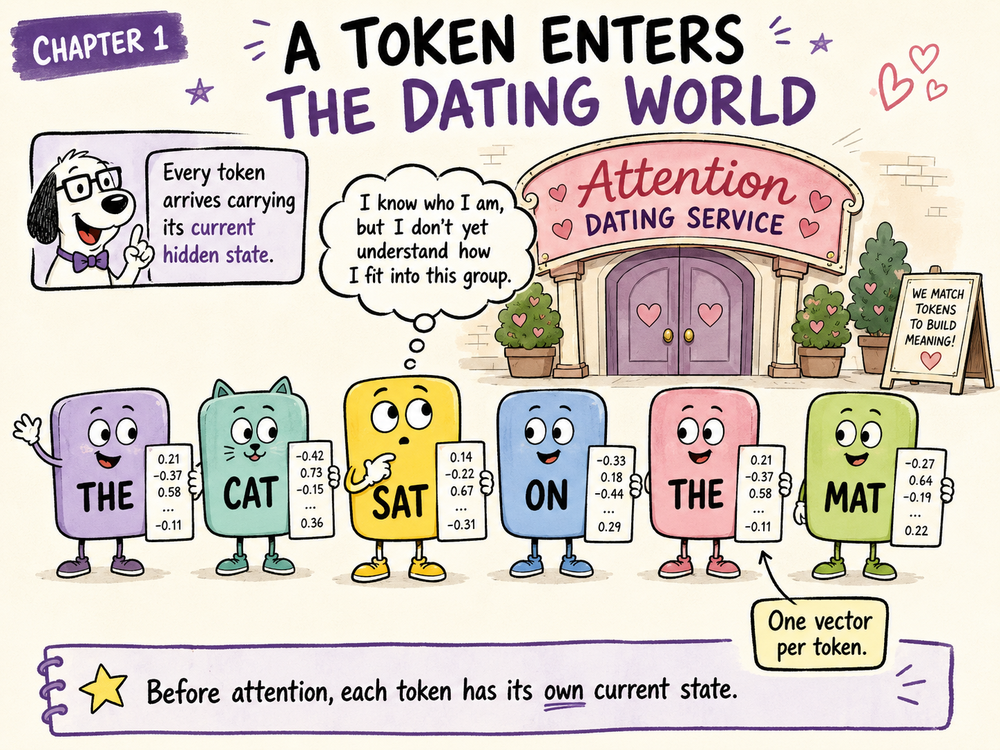
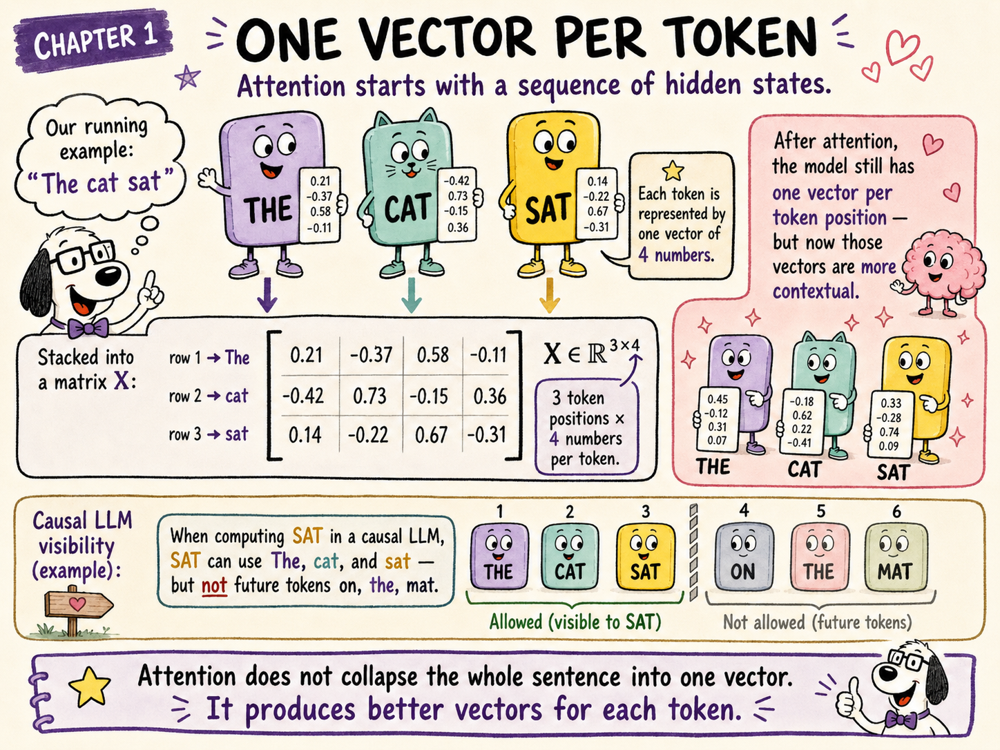
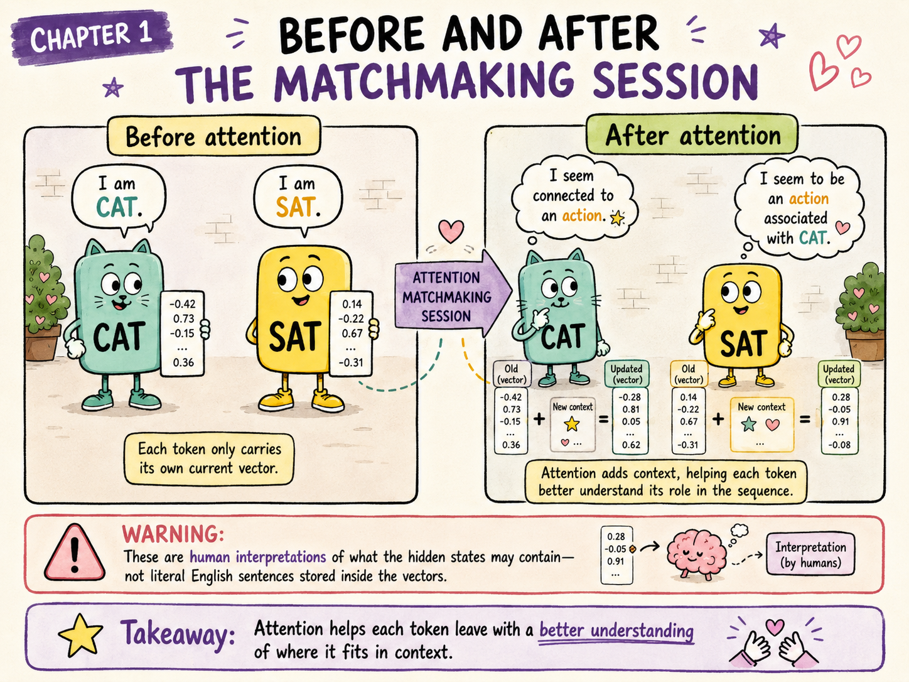

{.hero}

# The question this chapter answers

An LLM begins an attention layer with **one vector for every token**.

But what does that vector represent? And what exactly is attention supposed to improve?

**Every token enters attention carrying its current state. It leaves with a richer state that reflects how it fits among the visible tokens.**

# Opening scene: six tokens enter the agency

Our sentence is:

> **The cat sat on the mat.**

Imagine each token as a character entering the **Attention Dating Service**. Every character carries a card filled with numbers.

Those numbers are the token’s **current hidden state**.

The card does not contain:

- a sentence written in English;
- a fixed dictionary definition;
- the meaning of the whole sequence.

It contains the numerical representation associated with that particular token position **at this point in the model**.

`SAT` looks around and wonders:

> “I know who I currently am, but I do not yet understand how I fit into this group.”

That is the problem attention is designed to address.

# One vector per token

For a token at position $t$, call its current hidden-state vector:

$$
x_t
$$

To keep later calculations manageable, our technical running example will use only three tokens:

> **The cat sat**

and a model width of four:

$$
d_{\text{model}} = 4
$$

Suppose the current states are:

$$
x_{\text{The}} =
\begin{bmatrix}
0.21 & -0.37 & 0.58 & -0.11
\end{bmatrix}
$$

$$
x_{\text{cat}} =
\begin{bmatrix}
-0.42 & 0.73 & -0.15 & 0.36
\end{bmatrix}
$$

$$
x_{\text{sat}} =
\begin{bmatrix}
0.14 & -0.22 & 0.67 & -0.31
\end{bmatrix}
$$

Stacking the three row vectors gives the sequence matrix:

$$
X =
\begin{bmatrix}
0.21 & -0.37 & 0.58 & -0.11 \\
-0.42 & 0.73 & -0.15 & 0.36 \\
0.14 & -0.22 & 0.67 & -0.31
\end{bmatrix}
$$

Its shape is:

$$
X \in \mathbb{R}^{3 \times 4}
$$

That means:

- three token positions;
- four numbers per token.

## Remove the costumes

| Illustration | Transformer concept |
|---|---|
| Token character | One token position |
| Card carried by the token | Hidden-state vector $x_t$ |
| All tokens standing in sequence | Matrix $X$ |
| Four values on each card | $d_{\text{model}}=4$ |
| A richer card after attention | Updated contextual hidden state |

# The framework knows the row; the model receives the vector

The tensor keeps the token positions ordered:

- row 1 belongs to `The`;
- row 2 belongs to `cat`;
- row 3 belongs to `sat`.

That bookkeeping ensures the output row remains aligned with the input row.

But the learned operations work on the **contents of the row vector**. They do not automatically receive a special feature saying:

> “You are row 1.”

We will return to this distinction when we study positional encoding. For now, the important point is simply:

> One row is the model’s current representation of one token occurrence.

# Do the four coordinates have human meanings?

It is tempting to imagine:

- coordinate 1 means “noun”;
- coordinate 2 means “animal”;
- coordinate 3 means “verb”;
- coordinate 4 means “location.”

Do not take the toy dimensions that literally.

In a real LLM:

- hidden states may contain thousands of coordinates;
- information is usually distributed across many coordinates;
- one coordinate can participate in several computations;
- useful features can be represented by directions or combinations, not isolated numbers.

The four-dimensional vectors are small teaching models. They let us perform the exact calculations by hand without pretending that each coordinate has a neat dictionary label.

## Analogy warning

A hidden-state vector is not a little database row containing named fields such as `role=verb`. It is a learned numerical representation whose useful meaning emerges through later operations.

# Is the vector still just an embedding?

Not necessarily.

At the entrance to the first Transformer layer, a token state begins from something approximately like:

$$
\text{token information} + \text{position information}
$$

But after several Transformer layers, the vector has already received updates from previous attention and MLP sublayers.

So the most accurate wording is:

> A token enters an attention block carrying its **current hidden state**.

The initial token embedding is only the beginning of that state’s journey.

The passport metaphor is useful:

## At the model entrance

`SAT` mostly carries:

- its token identity;
- its position;
- the initial representation supplied to the model.

## After several layers

Its state may contain signals useful for recognising:

- that this occurrence behaves like an action;
- that `cat` is strongly related to it;
- that it participates in a particular sentence structure;
- what information it should help predict next.

These descriptions are human interpretations. Internally, the model still carries a vector.

# What does “contextual” mean?

Consider the token `bank`.

In:

> He deposited the cheque at the **bank**.

the hidden state for `bank` should become useful for computations involving a financial institution.

In:

> She rested beside the river **bank**.

the same token identity should develop a state useful for computations involving the side of a river.

The token spelling is unchanged. What changed is the surrounding context.

Attention helps move from:

> generic `BANK`

toward:

> this occurrence of `BANK` in this sentence.

The state does not need to become a verbal definition. It only needs to encode distinctions that help later layers and the final next-token prediction.

# Before attention

Before the current attention operation, each token carries its own current state.

In the dating-service story:

- `CAT` says, “This is who I currently am.”
- `SAT` says, “This is who I currently am.”
- every other visible token does the same.

At this stage, `SAT` has not yet received the contextual update produced by this attention sublayer.

# After attention

At a high level, attention produces an update for every token:

$$
\text{updated token state}
=
\text{current token state}
+
\text{contextual update}
$$

For `SAT`:

$$
x'_{\text{sat}}
=
x_{\text{sat}}
+
\Delta x_{\text{sat}}^{\text{attention}}
$$

The same pattern applies to all positions:

$$
X_{\text{updated}}
=
X
+
\Delta X_{\text{attention}}
$$

The number of token positions does not change. The model still has one row per token.

What changes is the quality of those rows as representations of the tokens **in context**.

In human language, we might interpret the change as:

- `CAT`: “I seem connected to an action.”
- `SAT`: “I seem to be an action associated with `CAT`.”

But the model does not literally store those sentences. It stores new vectors that make such relationships available to later computation.

**Attention does not turn SAT into CAT. SAT keeps its identity and receives information that helps it understand its relationship with CAT.**

# Does a token learn only from its immediate neighbourhood?

No. “Neighbourhood” is useful intuition, but it can be misleading if interpreted as only adjacent words.

An attention operation can gather information from any token position that the architecture allows it to see.

## Encoder-style self-attention

In the original Transformer encoder, each source token can inspect every source token.

## Causal decoder self-attention

In a GPT-style LLM, a token can inspect:

$$
\text{itself and earlier token positions}
$$

but not future positions.

For:

> The cat sat on the mat

when computing the state at `sat`, the visible prefix is:

> The cat sat

The future tokens:

> on the mat

are masked at that position.

When computing the state at the final `mat`, however, the complete prefix is visible.

So a better definition of neighbourhood is:

> The set of token positions this attention operation is permitted to inspect.

That set may extend far across the context window.

# What does each token ultimately gain?

Each token receives a new state that better answers:

> “Given the visible tokens in this sequence, where do I fit?”

For `sat`, the contextual update may make information available corresponding to:

- its relationship with `cat`;
- its likely role in the sequence;
- patterns in the tokens before it;
- information accumulated by earlier layers;
- features that help predict what comes next.

The token does not leave the service with one “soulmate.”

It leaves with a blended report about several relevant relationships.

We have not yet explained how that blend is calculated. That requires Query, Key, Value, scores, and softmax—the cast introduced in the next chapters.

# The technical picture

For a sequence of $n$ tokens:

$$
X =
\begin{bmatrix}
x_1 \\
x_2 \\
\vdots \\
x_n
\end{bmatrix}
$$

where:

$$
x_t \in \mathbb{R}^{d_{\text{model}}}
$$

Therefore:

$$
X \in \mathbb{R}^{n \times d_{\text{model}}}
$$

For the running example:

$$
n=3
\qquad\text{and}\qquad
d_{\text{model}}=4
$$

so:

$$
X \in \mathbb{R}^{3 \times 4}
$$

After the outputs from all attention heads are combined, attention produces a model-width update:

$$
\Delta X_{\text{attention}}
\in
\mathbb{R}^{3 \times 4}
$$

The residual addition is:

$$
X_{\text{updated}}
=
X
+
\Delta X_{\text{attention}}
$$

This is our first glimpse of the **residual stream**:

> Keep the current state and add a newly computed update.

# Why keep the old state?

Suppose attention completely replaced `sat` with information retrieved from `cat`.

The model could lose useful information already stored in the `sat` vector.

Residual addition instead says:

> Retain what you already know, then add what you learned.

In the dating-service analogy:

> `SAT` does not leave as `CAT`. It remains `SAT`, but now carries a richer understanding of how it relates to `CAT`.

We will study residual connections in detail after completing the attention calculation.

# Brain check

## 1. Does attention collapse the sentence into one vector?

No. Standard self-attention produces one updated vector for every token position.

## 2. Is the state entering every attention layer just the original embedding?

No. In later layers, it already contains information accumulated from previous attention and MLP sublayers.

## 3. What does attention give a token?

A contextual update derived from the visible token states.

## 4. In a causal LLM, can `sat` in “The cat sat on the mat” use `mat` while computing the state at `sat`?

No. `mat` is a future token relative to that position.

## 5. Does the updated `sat` vector literally contain the sentence “CAT is my subject”?

No. That is a human interpretation of information the numerical state may make usable.

# Chapter takeaway

Before attention, the model has:

$$
\boxed{\text{one current hidden-state vector per token}}
$$

Attention’s job is to help each token answer:

> “Given the visible token states, what information should update me?”

The result is:

$$
\boxed{
\text{existing token state}
+
\text{contextual update}
=
\text{richer token state}
}
$$

Or, in the dating-world story:

> **Every token enters knowing who it currently is. It leaves knowing more about where it fits.**

# Coming next: Meet the Question Coach

`SAT` has entered the matchmaking service carrying its current state.

But it cannot simply request:

> “Tell me everything.”

It needs a learned way to express what kind of information it is looking for.

That is the job of the **Question Coach**:

$$
W^Q
$$

In the next chapter, we will first meet the Question Coach as a character and then perform the exact calculation:

$$
q_{\text{sat}} = x_{\text{sat}} W^Q
$$
