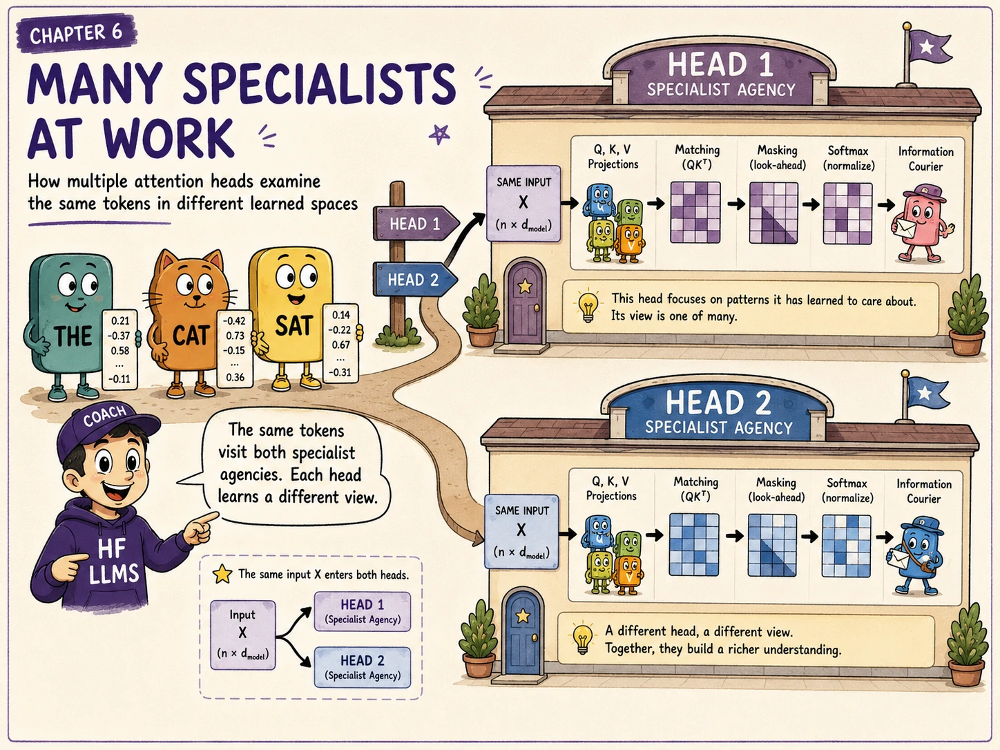
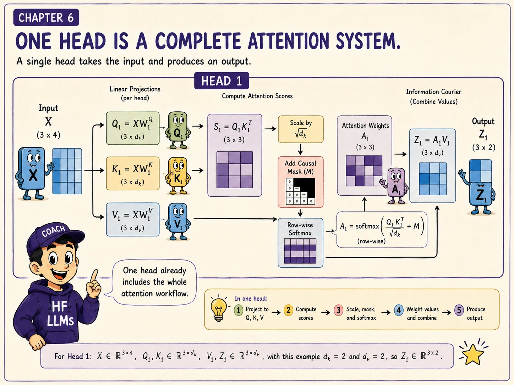
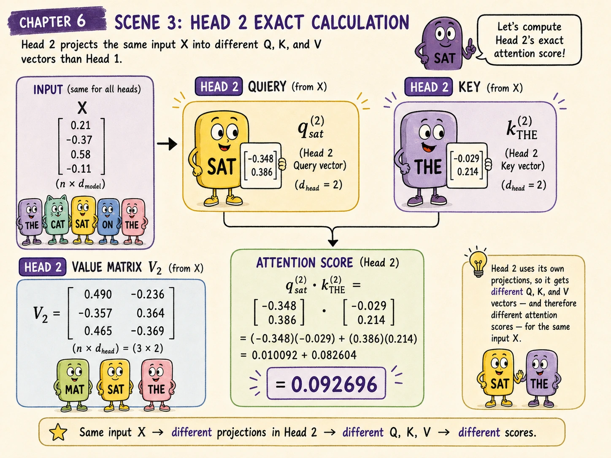
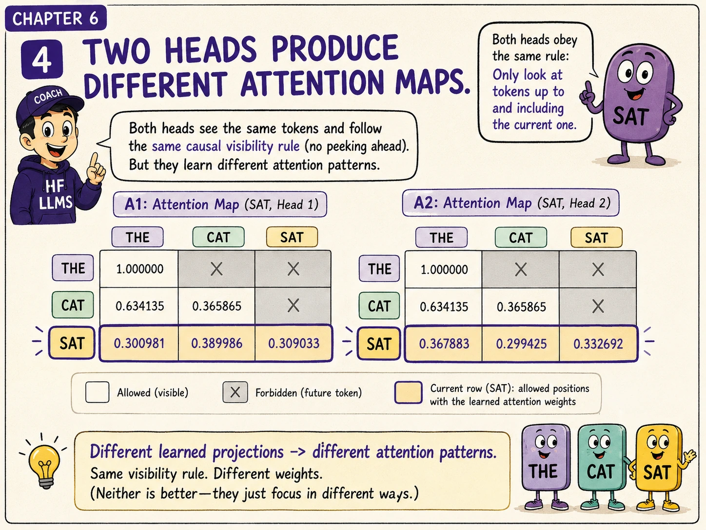
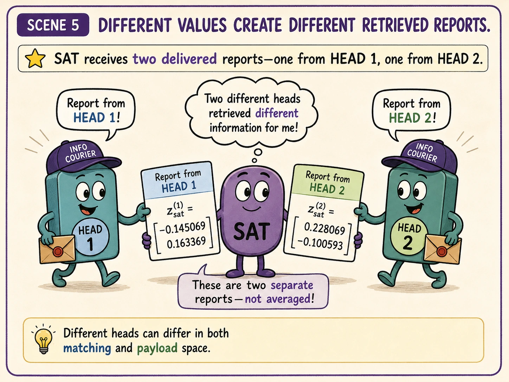
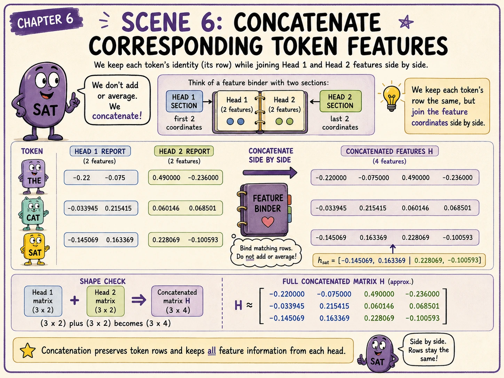
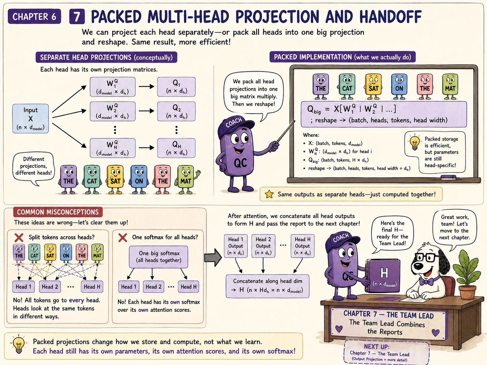

<!-- chapter-06-art:hero:start -->
{.hero}
<!-- chapter-06-art:hero:end -->

# The question this chapter answers

Chapter 5 completed one causal self-attention head:

$$
Z_1
=
\operatorname{softmax}
\left(
\frac{Q_1K_1^T}{\sqrt{d_k}}+M
\right)V_1
$$

For our three-token sequence, that head produced:

$$
Z_1\approx
\begin{bmatrix}
-0.220000 & -0.075000\\
-0.033945 & 0.215415\\
-0.145069 & 0.163369
\end{bmatrix}
$$

One head gives every token one learned way to search, match, and retrieve information.

But Transformers usually run several heads in parallel.

Why should the model repeat attention instead of simply making one head wider?

**Each attention head learns its own Query, Key, and Value projections. Multiple heads let the same token sequence participate in several different learned matching-and-retrieval systems at the same time.**

# Cold open: one sentence, two specialists

Our sequence is still:

> **The cat sat**

Imagine that two specialists inspect the same three current hidden states.

The first specialist uses:

$$
W_1^Q,\quad W_1^K,\quad W_1^V
$$

The second specialist uses:

$$
W_2^Q,\quad W_2^K,\quad W_2^V
$$

Both specialists receive the same current hidden-state matrix:

$$
X=
\begin{bmatrix}
0.21 & -0.37 & 0.58 & -0.11\\
-0.42 & 0.73 & -0.15 & 0.36\\
0.14 & -0.22 & 0.67 & -0.31
\end{bmatrix}
$$

But they transform it using different learned parameters.

Therefore, they can produce different:

- Queries;
- Keys;
- Values;
- attention weights;
- retrieved outputs.

The heads are not given human-written job descriptions. Their different behaviour emerges because their parameters are learned independently during training.

<!-- chapter-06-art:one-head:start -->

<!-- chapter-06-art:one-head:end -->

# One head is one complete attention system

For head \(r\):

$$
Q_r=XW_r^Q
$$

$$
K_r=XW_r^K
$$

$$
V_r=XW_r^V
$$

$$
A_r=
\operatorname{softmax}
\left(
\frac{Q_rK_r^T}{\sqrt{d_k}}+M
\right)
$$

$$
Z_r=A_rV_r
$$

Every head performs the full attention procedure.

A head is not merely one row of a matrix. It is one set of learned projections plus the matching, masking, normalisation, and retrieval operations that use those projections.

# The dimensions of our two-head example

We use:

$$
d_{\text{model}}=4
$$

and:

$$
h=2
$$

Each head has:

$$
d_k=d_v=2
$$

So one token state begins with four coordinates:

$$
x_t\in\mathbb{R}^{1\times4}
$$

Each head produces a two-coordinate output:

$$
z_t^{(r)}\in\mathbb{R}^{1\times2}
$$

Two such outputs can later be concatenated back into four coordinates:

$$
2+2=4
$$

## Why this split is common

When \(h\cdot d_v=d_{\text{model}}\), concatenating all head outputs restores the model width before the output projection.

That is a common design, not a mathematical requirement of attention itself.

# Head 1: the result we already know

Chapter 4 produced Head 1's attention matrix:

$$
A_1\approx
\begin{bmatrix}
1.000000 & 0 & 0\\
0.472931 & 0.527069 & 0\\
0.300981 & 0.389986 & 0.309033
\end{bmatrix}
$$

Chapter 5 produced its Value matrix:

$$
V_1=
\begin{bmatrix}
-0.220 & -0.075\\
0.133 & 0.476\\
-0.423 & 0.001
\end{bmatrix}
$$

Therefore:

$$
Z_1=A_1V_1
$$

and:

$$
Z_1\approx
\begin{bmatrix}
-0.220000 & -0.075000\\
-0.033945 & 0.215415\\
-0.145069 & 0.163369
\end{bmatrix}
$$

We will now build Head 2 from the same \(X\).

# Head 2 uses different learned projections

Suppose Head 2 has these Query, Key, and Value matrices:

$$
W_2^Q=
\begin{bmatrix}
0.3 & -0.5\\
0.6 & 0.2\\
-0.2 & 0.7\\
0.4 & -0.1
\end{bmatrix}
$$

$$
W_2^K=
\begin{bmatrix}
-0.4 & 0.6\\
0.5 & -0.2\\
0.3 & 0.1\\
-0.6 & 0.4
\end{bmatrix}
$$

$$
W_2^V=
\begin{bmatrix}
0.2 & 0.5\\
-0.3 & 0.4\\
0.6 & -0.2\\
0.1 & 0.7
\end{bmatrix}
$$

Each matrix has shape:

$$
4\times2
$$

The same four-dimensional current hidden state is therefore projected into a different two-dimensional space for this head.

<!-- chapter-06-art:head2-calculation:start -->

<!-- chapter-06-art:head2-calculation:end -->

# Calculate Head 2's Queries

For the full sequence:

$$
Q_2=XW_2^Q
$$

The result is:

$$
Q_2=
\begin{bmatrix}
-0.319 & 0.238\\
0.486 & 0.215\\
-0.348 & 0.386
\end{bmatrix}
$$

The rows are the Queries for THE, CAT, and SAT in Head 2.

For example, SAT's Head 2 Query is:

$$
q_{\text{sat}}^{(2)}=
\begin{bmatrix}
-0.348 & 0.386
\end{bmatrix}
$$

This differs from SAT's Head 1 Query because:

$$
W_1^Q\neq W_2^Q
$$

# Calculate Head 2's Keys

Similarly:

$$
K_2=XW_2^K
$$

which gives:

$$
K_2=
\begin{bmatrix}
-0.029 & 0.214\\
0.272 & -0.269\\
0.221 & 0.071
\end{bmatrix}
$$

These rows are searchable descriptions in Head 2's learned Key space.

# Calculate Head 2's Values

The Value matrix is:

$$
V_2=XW_2^V
$$

which gives:

$$
V_2=
\begin{bmatrix}
0.490 & -0.236\\
-0.357 & 0.364\\
0.465 & -0.369
\end{bmatrix}
$$

These payloads differ from Head 1's payloads because:

$$
W_1^V\neq W_2^V
$$

Even if two heads happened to assign similar attention weights, they could still retrieve different information because their Value vectors differ.

# Head 2's raw compatibility scores

The raw score matrix is:

$$
S_2=Q_2K_2^T
$$

Substituting the calculated matrices gives:

$$
S_2=
\begin{bmatrix}
0.060183 & -0.150790 & -0.053601\\
0.031916 & 0.074357 & 0.122671\\
0.092696 & -0.198490 & -0.049502
\end{bmatrix}
$$

One row belongs to each Query. One column belongs to each Key.

## Verify SAT's score against THE

SAT's Query is:

$$
q_{\text{sat}}^{(2)}=
\begin{bmatrix}
-0.348 & 0.386
\end{bmatrix}
$$

THE's Key is:

$$
k_{\text{The}}^{(2)}=
\begin{bmatrix}
-0.029 & 0.214
\end{bmatrix}
$$

Their dot product is:

$$
\begin{aligned}
q_{\text{sat}}^{(2)}\cdot k_{\text{The}}^{(2)}
&=(-0.348)(-0.029)+(0.386)(0.214)\\
&=0.010092+0.082604\\
&=0.092696
\end{aligned}
$$

That is the first entry of SAT's score row.

# Scale and causally mask Head 2

Because:

$$
d_k=2
$$

we divide every raw score by:

$$
\sqrt{2}
$$

The scaled scores are approximately:

$$
\frac{S_2}{\sqrt{2}}
\approx
\begin{bmatrix}
0.042556 & -0.106625 & -0.037902\\
0.022568 & 0.052578 & 0.086741\\
0.065546 & -0.140354 & -0.035003
\end{bmatrix}
$$

Applying the causal mask gives:

$$
L_2\approx
\begin{bmatrix}
0.042556 & -\infty & -\infty\\
0.022568 & 0.052578 & -\infty\\
0.065546 & -0.140354 & -0.035003
\end{bmatrix}
$$

The mask is the same causal rule used by Head 1. The learned scores differ, but future positions remain forbidden for every head.

<!-- chapter-06-art:attention-maps:start -->

<!-- chapter-06-art:attention-maps:end -->

# Head 2's attention weights

Applying softmax row by row gives:

$$
A_2\approx
\begin{bmatrix}
1.000000 & 0 & 0\\
0.492498 & 0.507502 & 0\\
0.367883 & 0.299425 & 0.332692
\end{bmatrix}
$$

Each row sums to 1, apart from tiny rounding differences.

For SAT:

| Source position | Head 1 weight | Head 2 weight |
|---|---:|---:|
| THE | 0.300981 | 0.367883 |
| CAT | 0.389986 | 0.299425 |
| SAT | 0.309033 | 0.332692 |

The two heads are looking at the same visible positions, but they distribute attention differently.

## Different does not mean interpretable

It is tempting to name one head “grammar” and another “meaning.” Sometimes trained heads show patterns that humans can describe, but the architecture does not assign those roles.

A head is defined by its learned computation, not by a guaranteed human-readable speciality.

# Retrieve Head 2's Values

The output is:

$$
Z_2=A_2V_2
$$

Substituting the matrices:

$$
Z_2
=
\begin{bmatrix}
1.000000 & 0 & 0\\
0.492498 & 0.507502 & 0\\
0.367883 & 0.299425 & 0.332692
\end{bmatrix}
\begin{bmatrix}
0.490 & -0.236\\
-0.357 & 0.364\\
0.465 & -0.369
\end{bmatrix}
$$

The result is:

$$
\boxed{
Z_2\approx
\begin{bmatrix}
0.490000 & -0.236000\\
0.060146 & 0.068501\\
0.228069 & -0.100593
\end{bmatrix}
}
$$

## Verify SAT's first Head 2 output coordinate

For SAT:

$$
z_{\text{sat}}^{(2)}
=
0.367883v_{\text{The}}^{(2)}
+
0.299425v_{\text{cat}}^{(2)}
+
0.332692v_{\text{sat}}^{(2)}
$$

The first coordinate is:

$$
\begin{aligned}
z_{\text{sat},1}^{(2)}
&=0.367883(0.490)
+0.299425(-0.357)
+0.332692(0.465)\\
&\approx0.180263-0.106895+0.154702\\
&\approx0.228069
\end{aligned}
$$

Head 2 has now completed its own retrieval.

<!-- chapter-06-art:head-outputs:start -->

<!-- chapter-06-art:head-outputs:end -->

# Put the two head outputs side by side

We now have:

$$
Z_1\in\mathbb{R}^{3\times2}
$$

and:

$$
Z_2\in\mathbb{R}^{3\times2}
$$

For one token position, concatenate the two head outputs along the feature dimension:

$$
h_t=
\operatorname{Concat}
\left(
z_t^{(1)},z_t^{(2)}
\right)
$$

For SAT:

$$
\begin{aligned}
h_{\text{sat}}
&=
\operatorname{Concat}
\left(
\begin{bmatrix}
-0.145069 & 0.163369
\end{bmatrix},
\begin{bmatrix}
0.228069 & -0.100593
\end{bmatrix}
\right)\\
&=
\begin{bmatrix}
-0.145069 & 0.163369 & 0.228069 & -0.100593
\end{bmatrix}
\end{aligned}
$$

For all positions:

$$
H=
\operatorname{Concat}(Z_1,Z_2)
$$

which gives:

$$
\boxed{
H\approx
\begin{bmatrix}
-0.220000 & -0.075000 & 0.490000 & -0.236000\\
-0.033945 & 0.215415 & 0.060146 & 0.068501\\
-0.145069 & 0.163369 & 0.228069 & -0.100593
\end{bmatrix}
}
$$

<!-- chapter-06-art:concatenation:start -->

<!-- chapter-06-art:concatenation:end -->

# Concatenation preserves token rows

Concatenation happens across features, not across token positions.

THE's Head 1 output is joined with THE's Head 2 output.

CAT's Head 1 output is joined with CAT's Head 2 output.

SAT's Head 1 output is joined with SAT's Head 2 output.

The token dimension remains:

$$
3
$$

while the feature width becomes:

$$
2+2=4
$$

Therefore:

$$
(3\times2)+(3\times2)\xrightarrow{\text{concatenate columns}}3\times4
$$

**Heads do not create extra token positions. They create extra feature views for each existing position.**

# Why not average the heads?

Averaging would produce:

$$
\frac{Z_1+Z_2}{2}
$$

but this would force coordinate 1 of Head 1 to share meaning with coordinate 1 of Head 2.

The architecture does not guarantee such alignment.

Concatenation keeps the head outputs separate:

$$
[z^{(1)}_1,z^{(1)}_2,z^{(2)}_1,z^{(2)}_2]
$$

A learned output projection can then decide how those coordinates should interact.

# Conceptual heads versus packed implementation

The equations are easiest to understand head by head:

$$
Q_r=XW_r^Q
$$

A practical implementation often stores all Query projections beside one another:

$$
W_{\text{big}}^Q=
\left[
W_1^Q\mid W_2^Q\mid\cdots\mid W_h^Q
\right]
$$

Then one large multiplication computes all Query coordinates:

$$
Q_{\text{big}}=XW_{\text{big}}^Q
$$

The same idea applies to Keys and Values.

The packed result is reshaped into a tensor such as:

$$
(\text{batch},\text{heads},\text{tokens},\text{head width})
$$

The hardware may execute one large operation, but separate column blocks still contain separate learned head parameters.

# Heads remain independent until concatenation

Before concatenation:

- Head 1 calculates its own score matrix;
- Head 2 calculates its own score matrix;
- softmax is performed independently within each head;
- each head mixes its own Values;
- one head's attention weights are not used to mix another head's Values.

Only after each \(Z_r\) exists do we assemble:

$$
H=\operatorname{Concat}(Z_1,\ldots,Z_h)
$$

# Common mistakes with multiple heads

## Mistake 1: splitting the tokens between heads

Every head normally receives representations for all token positions. Head 1 does not process THE while Head 2 processes CAT.

## Mistake 2: sharing all projections in ordinary multi-head attention

Standard multi-head attention gives each head separate learned Q, K, and V projection blocks.

Architectures such as grouped-query attention intentionally share some Keys and Values, but that is a variant introduced for efficiency.

## Mistake 3: applying one softmax across all heads

Each head has its own attention-score rows and performs its own softmax over candidate Key positions.

## Mistake 4: concatenating along the token dimension

The correct operation joins feature coordinates for corresponding positions. It does not turn three tokens into six tokens.

## Mistake 5: assuming each head is understandable in isolation

A trained head may contribute useful distributed features without corresponding to one clean linguistic rule.

## Mistake 6: stopping after concatenation

The concatenated matrix \(H\) is not yet the final multi-head attention output. A learned output projection still needs to mix the head coordinates.

# Checkpoint

## 1. What makes two heads different?

They have different learned Query, Key, and Value projection parameters and therefore can produce different scores, weights, payloads, and outputs.

## 2. Do heads receive different input tokens?

No. They normally receive the same sequence representation \(X\).

## 3. What is the output shape of one head in this example?

$$
Z_r\in\mathbb{R}^{3\times2}
$$

## 4. What is the concatenated shape for two heads?

$$
H\in\mathbb{R}^{3\times4}
$$

## 5. Along which dimension are head outputs concatenated?

Along the feature dimension for each corresponding token position.

## 6. Why are the heads not simply averaged?

Their coordinates are learned independently and are not guaranteed to have aligned meanings. Concatenation preserves all coordinates for learned mixing.

## 7. Does every head use the same causal mask?

In ordinary causal self-attention, yes. Every head must obey the same restriction against attending to future positions, although implementations may also apply other masks.

## 8. Does packed computation imply shared head parameters?

No. One large matrix can contain separate projection blocks for separate heads.

<!-- chapter-06-art:packed-handoff:start -->

<!-- chapter-06-art:packed-handoff:end -->

# Chapter takeaway

For head \(r\):

$$
Z_r
=
\operatorname{softmax}
\left(
\frac{(XW_r^Q)(XW_r^K)^T}{\sqrt{d_k}}+M
\right)
(XW_r^V)
$$

Multiple heads calculate multiple outputs:

$$
Z_1,Z_2,\ldots,Z_h
$$

Those outputs are concatenated by feature:

$$
H=\operatorname{Concat}(Z_1,\ldots,Z_h)
$$

For our two-head example:

$$
H\approx
\begin{bmatrix}
-0.220000 & -0.075000 & 0.490000 & -0.236000\\
-0.033945 & 0.215415 & 0.060146 & 0.068501\\
-0.145069 & 0.163369 & 0.228069 & -0.100593
\end{bmatrix}
$$

In our story:

> **Two specialists inspect the same clients using different learned criteria. Their reports stay separate until the organisation deliberately combines them.**

# Coming next: combine the specialists' reports

Concatenation places all head features beside one another, but it does not yet mix them.

The model applies a learned output projection:

$$
Y=HW^O
$$

Then the attention update rejoins the original token state through a residual connection and normalisation.

That is the job of Chapter 7:

# **The Team Lead Combines the Reports — Output Projection, Residuals, and LayerNorm**