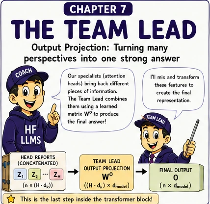
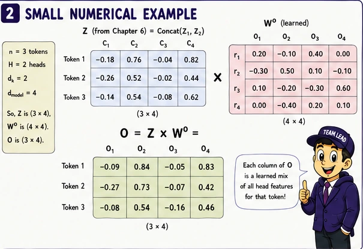
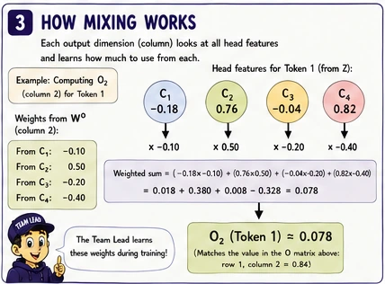
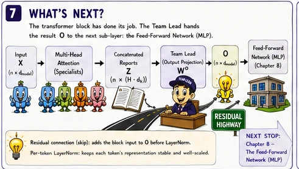
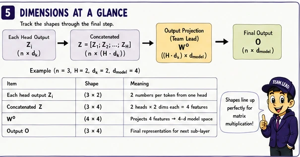
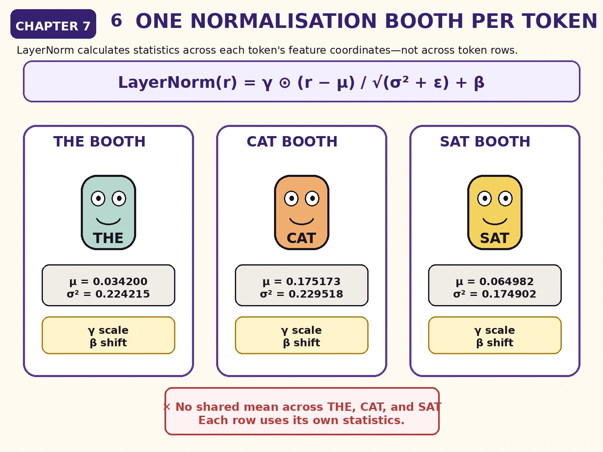
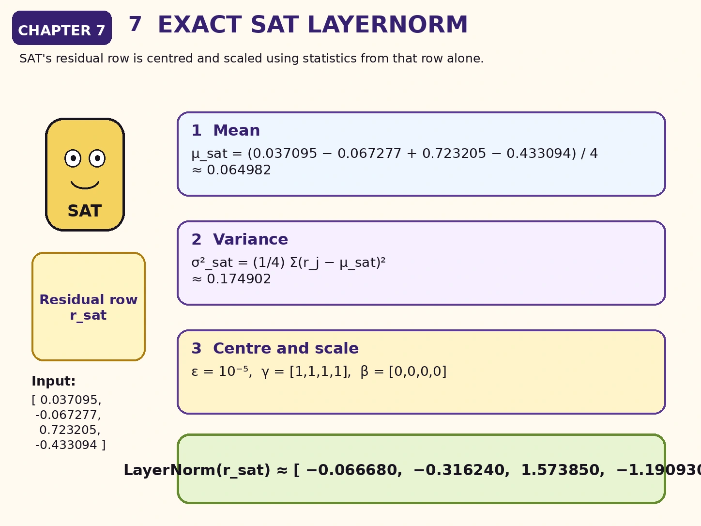
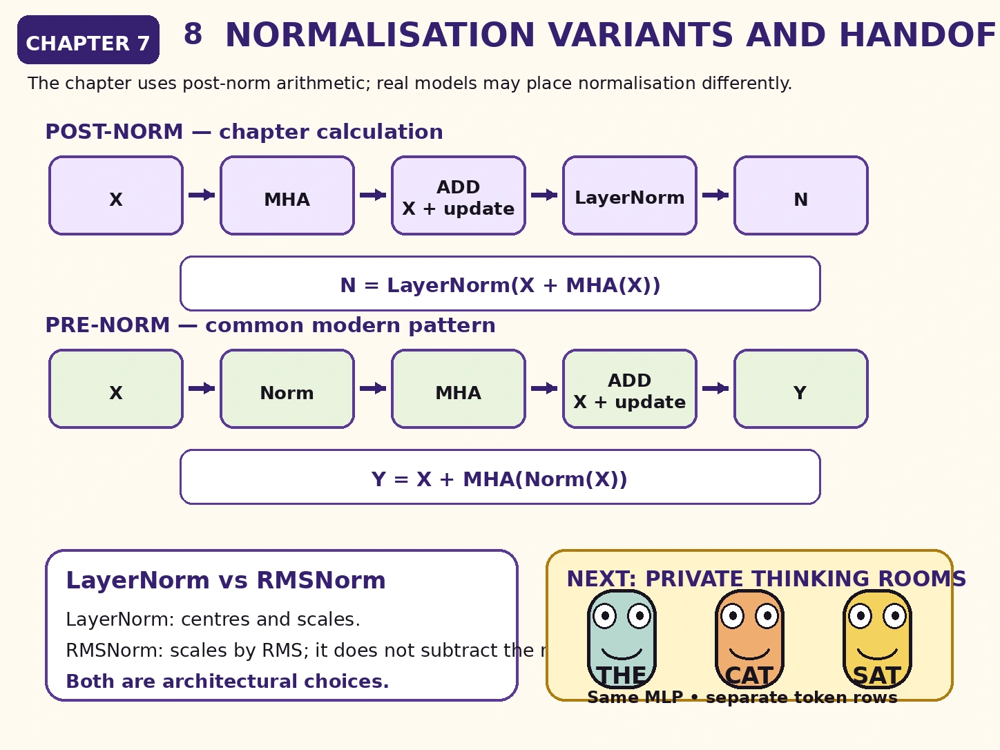

<!-- chapter-07-art:hero:start -->
{.hero}
<!-- chapter-07-art:hero:end -->

# The question this chapter answers

Chapter 6 ended with two head outputs concatenated into one matrix:

$$
H=\operatorname{Concat}(Z_1,Z_2)
$$

For our running example:

$$
H\approx
\begin{bmatrix}
-0.220000 & -0.075000 & 0.490000 & -0.236000\\
-0.033945 & 0.215415 & 0.060146 & 0.068501\\
-0.145069 & 0.163369 & 0.228069 & -0.100593
\end{bmatrix}
$$

The four columns contain two coordinates from Head 1 followed by two coordinates from Head 2.

But merely placing the reports side by side does not let the model combine them.

How does the Transformer:

1. mix information across heads;
2. preserve the token's earlier representation;
3. keep the updated representation numerically well behaved?

<div class="big-idea">

**The output projection mixes the head reports. The residual connection preserves the incoming token state. Normalisation controls the scale and distribution of the resulting features.**

</div>

# Cold open: the specialists submit separate reports

Head 1 and Head 2 return four numbers for SAT:

$$
h_{\text{sat}}
=
\begin{bmatrix}
-0.145069 & 0.163369 & 0.228069 & -0.100593
\end{bmatrix}
$$

The first two coordinates came from one learned attention system. The last two came from another.

The Transformer now needs a learned way to answer:

> Which combinations of these four reported features should become the attention update in the model's main representation space?

That is the job of the **output projection**:

$$
W^O
$$

In our story, the output projection is the Team Lead who reads all specialist reports and produces one combined recommendation for every token.

# The output projection

For all token positions:

$$
Y=HW^O
$$

Here:

- \(H\) is the concatenated head-output matrix;
- \(W^O\) is a learned output-projection matrix;
- \(Y\) is the multi-head attention update before the residual connection.

If:

$$
H\in\mathbb{R}^{n\times(hd_v)}
$$

then a common output projection has shape:

$$
W^O\in\mathbb{R}^{(hd_v)\times d_{\text{model}}}
$$

Therefore:

$$
Y\in\mathbb{R}^{n\times d_{\text{model}}}
$$

In our example:

$$
hd_v=2\cdot2=4
$$

and:

$$
d_{\text{model}}=4
$$

so:

$$
W^O\in\mathbb{R}^{4\times4}
$$

# The output projection for our example

Suppose the learned matrix is:

$$
W^O=
\begin{bmatrix}
0.5 & -0.2 & 0.1 & 0.3\\
0.2 & 0.4 & -0.3 & 0.1\\
-0.1 & 0.3 & 0.6 & -0.2\\
0.4 & 0.1 & 0.2 & 0.5
\end{bmatrix}
$$

The multi-head attention update is:

$$
Y=HW^O
$$

Substituting the values:

$$
Y=
\begin{bmatrix}
-0.220000 & -0.075000 & 0.490000 & -0.236000\\
-0.033945 & 0.215415 & 0.060146 & 0.068501\\
-0.145069 & 0.163369 & 0.228069 & -0.100593
\end{bmatrix}
W^O
$$

The result is:

$$
\boxed{
Y\approx
\begin{bmatrix}
-0.268400 & 0.137400 & 0.247300 & -0.289500\\
0.047496 & 0.117849 & -0.018231 & 0.033579\\
-0.102905 & 0.152723 & 0.053205 & -0.123094
\end{bmatrix}
}
$$

<!-- chapter-07-art:output-calculation:start -->

<!-- chapter-07-art:output-calculation:end -->

# Verify SAT's output projection

SAT enters the output projection with:

$$
h_{\text{sat}}
=
\begin{bmatrix}
-0.145069 & 0.163369 & 0.228069 & -0.100593
\end{bmatrix}
$$

The first output coordinate uses the first column of \(W^O\):

$$
\begin{aligned}
y_{\text{sat},1}
&=(-0.145069)(0.5)
+(0.163369)(0.2)\\
&\quad +(0.228069)(-0.1)
+(-0.100593)(0.4)\\
&\approx-0.072535+0.032674-0.022807-0.040237\\
&\approx-0.102905
\end{aligned}
$$

The remaining coordinates are calculated from the remaining columns:

$$
y_{\text{sat}}
\approx
\begin{bmatrix}
-0.102905 & 0.152723 & 0.053205 & -0.123094
\end{bmatrix}
$$

<!-- chapter-07-art:feature-mixing:start -->

<!-- chapter-07-art:feature-mixing:end -->

# What \(W^O\) actually mixes

Before \(W^O\), SAT's row is arranged as:

$$
[
\underbrace{z_{\text{sat},1}^{(1)},z_{\text{sat},2}^{(1)}}_{\text{Head 1}},
\underbrace{z_{\text{sat},1}^{(2)},z_{\text{sat},2}^{(2)}}_{\text{Head 2}}
]
$$

Each column of \(W^O\) can combine coordinates from both heads.

For example, one output feature may depend on:

- a positive contribution from one Head 1 coordinate;
- a negative contribution from another Head 1 coordinate;
- contributions from both Head 2 coordinates.

The output projection does **not** perform another Query–Key comparison. It is an ordinary learned linear transformation across the concatenated feature dimension.

<div class="warning">

## \(W^O\) does not add more attention

The cross-token retrieval already happened inside each head through \(A_rV_r\).

The output projection mixes the retrieved feature coordinates at each token position independently. It does not create a new attention matrix.

</div>

<!-- chapter-07-art:residual-highway:start -->

<!-- chapter-07-art:residual-highway:end -->

# The residual highway

The attention update \(Y\) is not normally allowed to erase the input \(X\).

Instead, the block creates a residual sum:

$$
R=X+Y
$$

The original input is:

$$
X=
\begin{bmatrix}
0.21 & -0.37 & 0.58 & -0.11\\
-0.42 & 0.73 & -0.15 & 0.36\\
0.14 & -0.22 & 0.67 & -0.31
\end{bmatrix}
$$

Adding \(Y\) gives:

$$
\boxed{
R\approx
\begin{bmatrix}
-0.058400 & -0.232600 & 0.827300 & -0.399500\\
-0.372504 & 0.847849 & -0.168231 & 0.393579\\
0.037095 & -0.067277 & 0.723205 & -0.433094
\end{bmatrix}
}
$$

For SAT:

$$
\begin{aligned}
r_{\text{sat}}
&=x_{\text{sat}}+y_{\text{sat}}\\
&=
\begin{bmatrix}
0.14 & -0.22 & 0.67 & -0.31
\end{bmatrix}
+
\begin{bmatrix}
-0.102905 & 0.152723 & 0.053205 & -0.123094
\end{bmatrix}\\
&=
\begin{bmatrix}
0.037095 & -0.067277 & 0.723205 & -0.433094
\end{bmatrix}
\end{aligned}
$$

# Why residual connections matter

The residual path creates a simple route from the block input to its output:

$$
X\longrightarrow X+\text{update}
$$

This has several consequences.

## The sublayer learns an update

The attention mechanism does not need to reconstruct everything already present in \(X\). It can focus on producing a useful correction or addition.

## Information has a direct path

If the attention update is small, much of the original representation remains available.

## Optimisation becomes easier

During training, residual paths provide shorter routes for signals and gradients through a deep stack of blocks.

<div class="translation">

## A useful mental model

Think of the residual stream as the token's evolving working document.

Each sublayer writes an amendment into that document instead of replacing the whole document from scratch.

</div>

<!-- chapter-07-art:shape-match:start -->

<!-- chapter-07-art:shape-match:end -->

# Residual addition requires matching shapes

We can add \(X\) and \(Y\) because:

$$
X\in\mathbb{R}^{3\times4}
$$

and:

$$
Y\in\mathbb{R}^{3\times4}
$$

Element-wise addition requires corresponding dimensions to match:

$$
(3\times4)+(3\times4)=(3\times4)
$$

This is one reason the multi-head output projection usually returns to \(d_{\text{model}}\).

Without that compatible width, the residual addition would require another adaptation.

<!-- design-pattern-01:full:start -->
# Design Pattern — Residual Connections

## Learn an Update, Keep the State

The standard ML-community name for the structure used above is a **residual connection**.

The broader family is called **skip connections**. When the bypass carries $x$ unchanged, it is more specifically an **identity skip connection**.

<div class="big-idea">

**Preserve the current representation as a sensible default, and let the learned branch contribute a correction.**

</div>

## The recurring problem: replacement is a demanding job

Suppose a learned sublayer uses the replacement-only form:

$$
y=F(x)
$$

The branch $F$ must produce the complete next representation. Anything useful in $x$ survives only if the branch reconstructs or preserves it.

That raises three questions in a deep network:

- What happens to information that the branch does not reproduce?
- What should the layer do when very little change is useful?
- How does a correction signal travel through many composed transformations?

A replacement layer is not inherently wrong. The issue is that repeatedly rebuilding an already-useful state can make a deep architecture harder to optimise.

## The pattern

A residual connection keeps a direct route and adds the learned transformation:

$$
\boxed{y=x+F(x)}
$$

Here:

- $x$ is the incoming representation;
- $F(x)$ is the learned **residual update**;
- $y$ is the amended representation.

If the desired mapping is $H(x)$, the branch can be viewed as learning the difference:

$$
F(x)=H(x)-x
$$

so that:

$$
H(x)=x+F(x)
$$

This is an interpretation of what the architecture makes easy to learn. The model does not need to explicitly calculate a target residual during inference.

## In our Transformer

For this attention sublayer:

$$
R=X+Y
$$

where:

- $X$ is the incoming token-state matrix;
- $Y$ is the attention update returned to the model width;
- $R$ is the amended residual-stream state.

The important interpretation is:

> Attention writes into the token's evolving state. It does not replace the token with an attention report.

For SAT, the chapter already calculated:

$$
x_{\text{sat}}
=
\begin{bmatrix}
0.14 & -0.22 & 0.67 & -0.31
\end{bmatrix}
$$

and:

$$
y_{\text{sat}}
\approx
\begin{bmatrix}
-0.102905 & 0.152723 & 0.053205 & -0.123094
\end{bmatrix}
$$

The residual result is:

$$
r_{\text{sat}}
=x_{\text{sat}}+y_{\text{sat}}
\approx
\begin{bmatrix}
0.037095 & -0.067277 & 0.723205 & -0.433094
\end{bmatrix}
$$

The attention output is being used as an **amendment**, not as a complete replacement state.

## A counterfactual: replacement versus residual

Compare the two designs:

```text
replacement-only: output = Y
residual:         output = X + Y
```

If the attention branch temporarily produced a near-zero update, the replacement-only form would produce a near-zero state. The residual form would preserve the current state.

## The zero-update sanity check

Let:

$$
x=
\begin{bmatrix}
2 & -1 & 0.5
\end{bmatrix}
$$

and suppose:

$$
F(x)=
\begin{bmatrix}
0 & 0 & 0
\end{bmatrix}
$$

With replacement:

$$
y=F(x)=0
$$

With a residual connection:

$$
y=x+F(x)=x
$$

Identity is therefore an easy fallback behaviour: if the branch initially contributes little, the block can behave approximately like “do no harm.”

## What the pattern buys us

### 1. The branch can focus on an update

The sublayer does not need to reconstruct everything already available in the incoming representation.

### 2. Useful information has a direct route

The output does not depend entirely on every useful coordinate being recreated by the learned branch.

### 3. Deep stacks gain additional optimisation routes

During backpropagation, the shared input receives a contribution through the direct addition and another through the learned branch. Chapter 14 develops that calculation.

Use cautious wording here: residual connections often make deep networks easier to train, but they do not guarantee that signals or gradients remain large, small, or stable. The branch can amplify, attenuate, reinforce, or oppose other contributions.

### 4. The architecture gains a stable interface

When sublayers return to $d_{\text{model}}$, many different transformations can read and write one shared representation format.

## The same standard pattern in a ResNet

Residual connections became widely known through residual networks for computer vision. A simplified ResNet block uses:

$$
y=x+F_{\text{conv}}(x)
$$

The convolutional branch learns a visual-feature update while the input feature map travels along the bypass.

Consider a tiny toy feature map:

$$
x=
\begin{bmatrix}
1.0 & 0.8\\
0.2 & 0.0
\end{bmatrix}
$$

Suppose the convolutional branch produces:

$$
F_{\text{conv}}(x)=
\begin{bmatrix}
0.1 & -0.1\\
0.3 & 0.2
\end{bmatrix}
$$

Then:

$$
y=x+F_{\text{conv}}(x)
=
\begin{bmatrix}
1.1 & 0.7\\
0.5 & 0.2
\end{bmatrix}
$$

This is toy arithmetic for the shared architectural idea, not a claim about the exact features learned by a particular ResNet.

| Transformer residual block | ResNet residual block |
|---|---|
| token-state matrix $X$ | image feature map $x$ |
| attention or MLP branch | convolutional branch |
| contextual or feature update | visual-feature update |
| element-wise addition | element-wise addition |
| stable model width | compatible channel and spatial shape inside an identity block |

## Residual connection versus other skip connections

Not every skip connection is the same operation.

- **Residual and identity skip connections** usually add compatible tensors.
- **Projection residual connections** use a transform $P(x)$ on the bypass when shapes differ:

$$
y=P(x)+F(x)
$$

- **U-Net skip connections** commonly concatenate encoder and decoder features.
- **DenseNet connections** concatenate features from multiple earlier layers.
- **Highway networks** use learned gates to control transformed and bypass paths.

These architectures are related because information bypasses transformations, but their merge operations and purposes are not identical.

## Use this pattern when

- the incoming representation is already useful;
- the desired operation is naturally a refinement or amendment;
- identity is a sensible fallback;
- a deep stack should preserve information across many transformations;
- the branch can return a compatible shape, or a deliberate projection can make it compatible.

## Watch out for

- residual addition requires compatible shapes;
- a projection bypass is not a pure identity route;
- large or poorly scaled updates can still destabilise the stream;
- residual connections do not replace normalisation, suitable initialisation, or sound optimisation choices;
- direct and branch gradient contributions can reinforce or cancel each other;
- “skip connection” is a broader term than “additive residual connection.”

<div class="translation">

## Remove the costumes

| Story element | ML meaning |
|---|---|
| original case file | input representation $x$ |
| straight highway | identity skip path |
| specialist office | learned branch $F$ |
| amendment sheet | residual update $F(x)$ |
| addition junction | element-wise sum |
| updated case file | output $y=x+F(x)$ |

</div>

<div class="exercise">

## Pattern check

1. If $F(x)=0$, what does an identity residual block return?
2. Why must $x$ and $F(x)$ normally have compatible shapes?
3. Is a U-Net concatenation skip exactly the same operation as $x+F(x)$?

**Answers:** It returns $x$; compatible shapes are required for element-wise addition; and no, U-Net skips belong to the broader skip-connection family but commonly use concatenation.

</div>

```text
Standard name: Residual connection
First preview: Chapter 1
Full pattern: Chapter 7
Reappears: Chapters 8 and 10
Backward-path deep dive: Chapter 14
Non-LLM analogue: ResNet identity block
```
<!-- design-pattern-01:full:end -->

# Why normalise after the residual sum?

The coordinates in \(R\) can have different means and scales.

As many blocks are stacked, uncontrolled scale changes can make optimisation difficult.

Layer Normalisation transforms each token row independently.

For a token vector \(r\in\mathbb{R}^{d_{\text{model}}}\):

$$
\mu=\frac{1}{d_{\text{model}}}\sum_{j=1}^{d_{\text{model}}}r_j
$$

$$
\sigma^2=
\frac{1}{d_{\text{model}}}
\sum_{j=1}^{d_{\text{model}}}(r_j-\mu)^2
$$

The normalised vector is:

$$
\widehat{r}_j=
\frac{r_j-\mu}{\sqrt{\sigma^2+\epsilon}}
$$

A full LayerNorm then applies learned scale and shift parameters:

$$
\operatorname{LayerNorm}(r)
=
\gamma\odot\widehat{r}+\beta
$$

where:

$$
\gamma,\beta\in\mathbb{R}^{d_{\text{model}}}
$$

<!-- chapter-07-art:per-token-layernorm:start -->

<!-- chapter-07-art:per-token-layernorm:end -->

# LayerNorm works within each token

For our matrix:

$$
R\in\mathbb{R}^{3\times4}
$$

LayerNorm calculates a different mean and variance for each row.

It does not combine THE's features with CAT's features.

It does not calculate one mean over the whole batch.

Conceptually:

```text
THE row -> its own mean and variance
CAT row -> its own mean and variance
SAT row -> its own mean and variance
```

This is different from Batch Normalisation, which uses statistics across examples or spatial positions depending on its application.

<!-- chapter-07-art:exact-layernorm:start -->

<!-- chapter-07-art:exact-layernorm:end -->

# Exact LayerNorm calculation for SAT

SAT's residual row is:

$$
r_{\text{sat}}
=
\begin{bmatrix}
0.037095 & -0.067277 & 0.723205 & -0.433094
\end{bmatrix}
$$

## Step 1: calculate the mean

$$
\begin{aligned}
\mu_{\text{sat}}
&=\frac{0.037095-0.067277+0.723205-0.433094}{4}\\
&\approx0.064982
\end{aligned}
$$

## Step 2: calculate the variance

$$
\begin{aligned}
\sigma_{\text{sat}}^2
&=\frac{1}{4}
\left[
(0.037095-0.064982)^2
+(-0.067277-0.064982)^2
\right.\\
&\qquad\left.
+(0.723205-0.064982)^2
+(-0.433094-0.064982)^2
\right]\\
&\approx0.174902
\end{aligned}
$$

## Step 3: centre and scale

Using:

$$
\epsilon=10^{-5}
$$

and, for this worked example:

$$
\gamma=
\begin{bmatrix}1&1&1&1\end{bmatrix}
$$

$$
\beta=
\begin{bmatrix}0&0&0&0\end{bmatrix}
$$

we obtain:

$$
\operatorname{LayerNorm}(r_{\text{sat}})
\approx
\begin{bmatrix}
-0.066680 & -0.316240 & 1.573850 & -1.190930
\end{bmatrix}
$$

The learned \(\gamma\) and \(eta\) are set to identity values here only to keep the arithmetic focused on normalisation. In a trained model, they are learned parameters.

# Normalise every token row

Applying the same LayerNorm operation independently to every row gives:

$$
\boxed{
N\approx
\begin{bmatrix}
-0.195555 & -0.563435 & 1.674888 & -0.915898\\
-1.143160 & 1.404068 & -0.716785 & 0.455877\\
-0.066680 & -0.316240 & 1.573850 & -1.190930
\end{bmatrix}
}
$$

For each row, before the learned \(\gamma\) and \(eta\):

- the mean is approximately zero;
- the variance is approximately one.

Tiny differences arise because of \(\epsilon\) and rounding.

# What LayerNorm preserves and changes

LayerNorm changes the numerical coordinates, but it does not shuffle token positions.

THE remains row 1. CAT remains row 2. SAT remains row 3.

It also does not force every token to become identical. Each row is centred and scaled according to its own pattern of feature values.

A vector's relative feature pattern still matters after normalisation.

# Post-norm and pre-norm architectures

Our running calculation uses the original post-norm-style order:

$$
N=\operatorname{LayerNorm}(X+\operatorname{MHA}(X))
$$

Many modern decoder-only LLMs instead use pre-normalisation:

$$
Y=X+\operatorname{MHA}(\operatorname{Norm}(X))
$$

The key difference is where normalisation is placed.

## Post-norm view

```text
input
  -> attention
  -> add residual
  -> normalise
```

## Pre-norm view

```text
input
  -> normalise
  -> attention
  -> add residual
```

Pre-normalisation often makes very deep models easier to train because the residual stream has a particularly direct path through the stack.

The conceptual roles remain the same:

- attention produces an update;
- the residual path preserves the stream;
- normalisation controls feature scale.

<div class="warning">

## Do not mix formulas halfway through a calculation

Pre-norm and post-norm are both valid architectural patterns, but a numerical example must choose one order and follow it consistently.

Our chapters use post-norm arithmetic for a clean historical presentation. When reading a real model implementation, inspect its exact block definition.

</div>

# LayerNorm and RMSNorm

Many modern LLMs use RMSNorm instead of LayerNorm.

RMSNorm scales a vector using its root-mean-square magnitude but does not subtract the mean in the same way:

$$
\operatorname{RMS}(x)
=
\sqrt{
\frac{1}{d}\sum_{j=1}^{d}x_j^2+\epsilon
}
$$

A simplified RMSNorm is:

$$
\operatorname{RMSNorm}(x)
=
\gamma\odot\frac{x}{\operatorname{RMS}(x)}
$$

We use LayerNorm here because it makes the centring and scaling operations explicit. The next chapters can treat alternative normalisation choices as architectural variants rather than changes to the basic attention idea.

# The attention sublayer so far

For \(h\) heads:

$$
Z_r
=
\operatorname{Attention}(Q_r,K_r,V_r)
$$

Concatenate:

$$
H=\operatorname{Concat}(Z_1,\ldots,Z_h)
$$

Project:

$$
Y=HW^O
$$

Add the residual:

$$
R=X+Y
$$

Normalise in our post-norm example:

$$
N=\operatorname{LayerNorm}(R)
$$

The resulting \(N\) contains one updated four-dimensional representation per token position.

# Common mistakes in the attention sublayer

## Mistake 1: treating concatenation as learned mixing

Concatenation only places coordinates beside one another. \(W^O\) performs the learned mixing.

## Mistake 2: thinking \(W^O\) mixes tokens

It mixes feature coordinates within each row. Cross-token information was already retrieved by attention.

## Mistake 3: replacing \(X\) with the attention output

The residual form adds the update to the incoming representation.

## Mistake 4: adding incompatible shapes

Residual operands must have the same shape or be deliberately projected into compatible shapes.

## Mistake 5: normalising across token positions

LayerNorm is normally applied over the feature coordinates of each token representation.

## Mistake 6: assuming \(\gamma=1\) and \(eta=0\) in a trained model

Those values are only a simplifying choice for our worked calculation. They are trainable parameters.

## Mistake 7: assuming every Transformer uses post-norm

Many modern LLMs use pre-norm and often RMSNorm. The exact ordering is an architectural choice.

# Checkpoint

<div class="exercise">

## 1. What is the purpose of \(W^O\)?

It learns how to mix the concatenated feature coordinates produced by all attention heads and maps them into the model's output width.

## 2. Does \(W^O\) calculate attention scores?

No. It is a linear projection applied after each head has completed attention.

## 3. Why does the output usually return to \(d_{\text{model}}\)?

That width makes the attention update compatible with the residual stream and with later block operations.

## 4. What does the residual connection calculate in this chapter?

$$
R=X+Y
$$

## 5. Why is the residual path useful?

It preserves a direct route for the incoming representation and lets the sublayer learn an update rather than a full replacement.

## 6. Over which coordinates does LayerNorm calculate statistics?

Over the feature coordinates within each token row.

## 7. Does LayerNorm mix THE, CAT, and SAT?

No. Each row is normalised independently.

## 8. What is the difference between pre-norm and post-norm?

Pre-norm applies normalisation before the sublayer; post-norm applies it after the residual addition.

## 9. What is the output shape after this attention sublayer?

$$
N\in\mathbb{R}^{3\times4}
$$

</div>

<!-- chapter-07-art:variants-handoff:start -->

<!-- chapter-07-art:variants-handoff:end -->

# Chapter takeaway

Multiple head outputs are concatenated:

$$
H=\operatorname{Concat}(Z_1,\ldots,Z_h)
$$

The output projection mixes their coordinates:

$$
Y=HW^O
$$

The residual stream preserves the incoming state:

$$
R=X+Y
$$

Our post-norm example then applies:

$$
N=\operatorname{LayerNorm}(R)
$$

For our three tokens:

$$
N\approx
\begin{bmatrix}
-0.195555 & -0.563435 & 1.674888 & -0.915898\\
-1.143160 & 1.404068 & -0.716785 & 0.455877\\
-0.066680 & -0.316240 & 1.573850 & -1.190930
\end{bmatrix}
$$

In our story:

> **The specialists produce separate reports. The Team Lead combines them. The residual highway keeps the original case file available, and normalisation keeps the updated file numerically manageable.**

# Coming next: private processing inside each token

Attention allowed information to move between visible token positions.

The next sublayer does something different. It applies the same small neural network to each token row independently:

$$
\operatorname{FFN}(n)
=
\phi(nW_1+b_1)W_2+b_2
$$

That is the job of Chapter 8:

# **The Private Thinking Room — The Position-Wise MLP and a Complete Transformer Block**