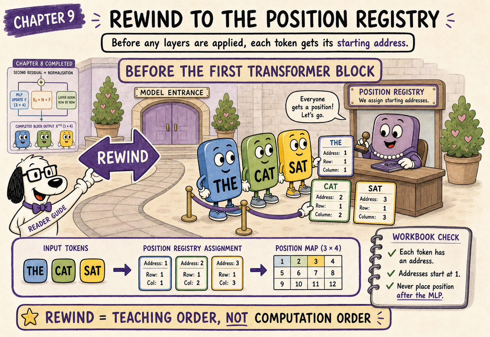
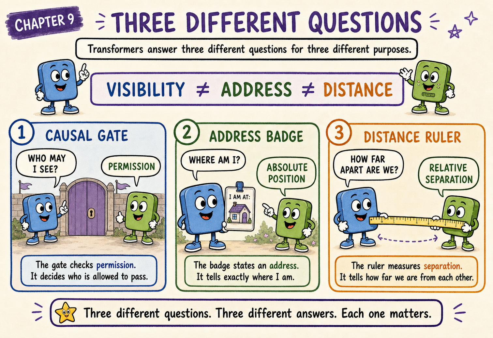
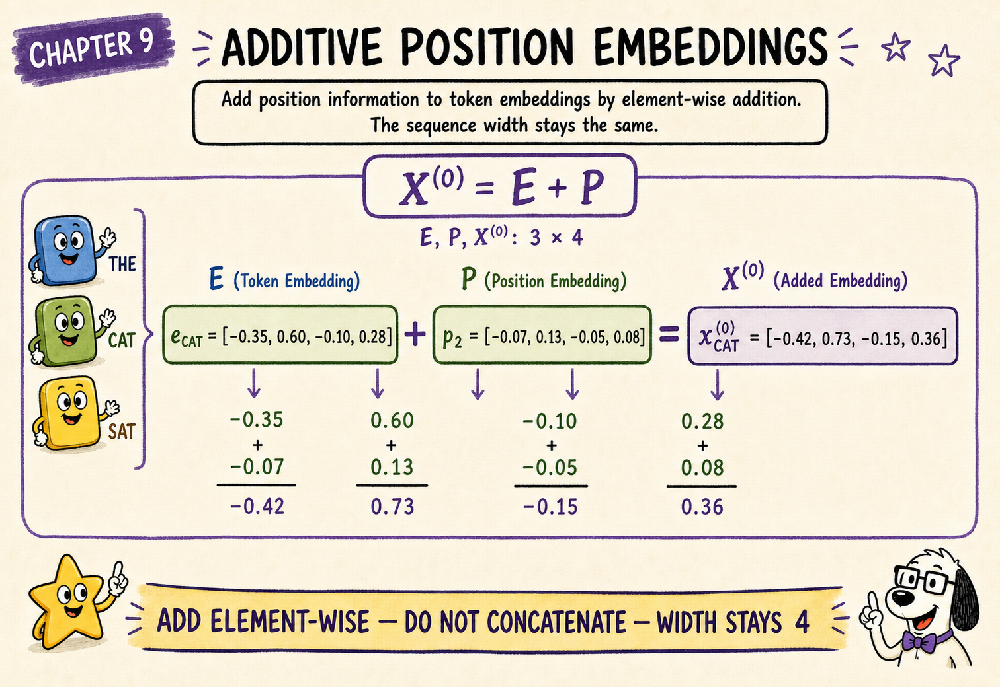
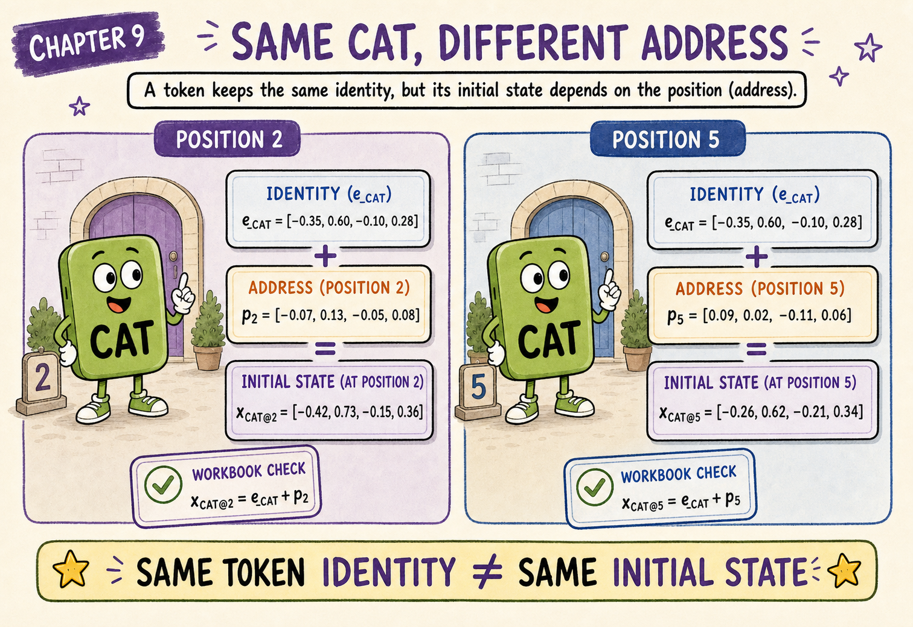
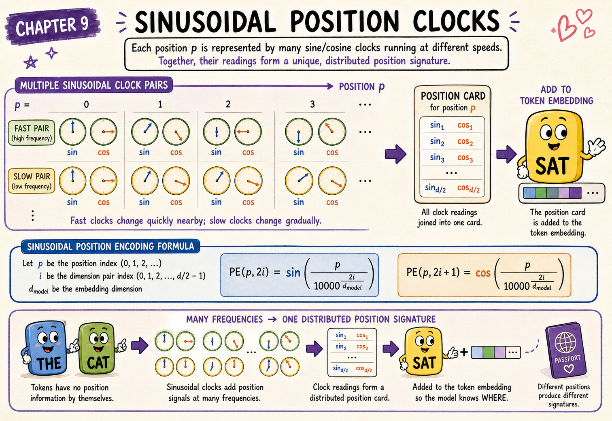
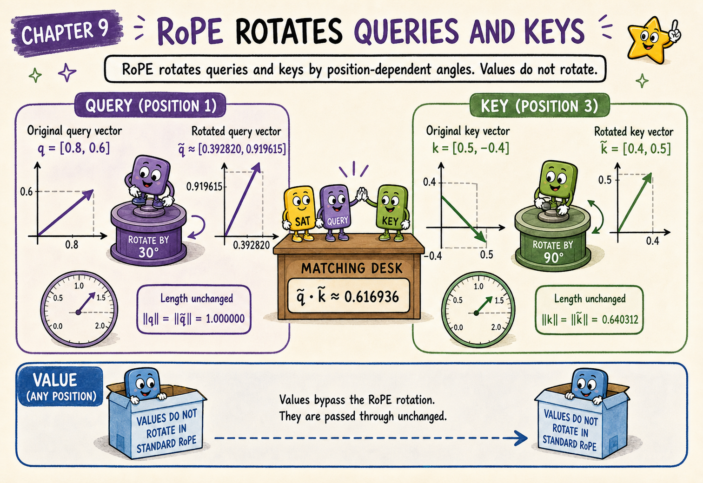
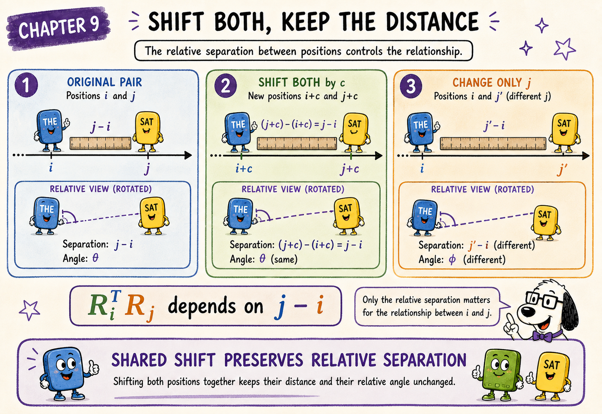
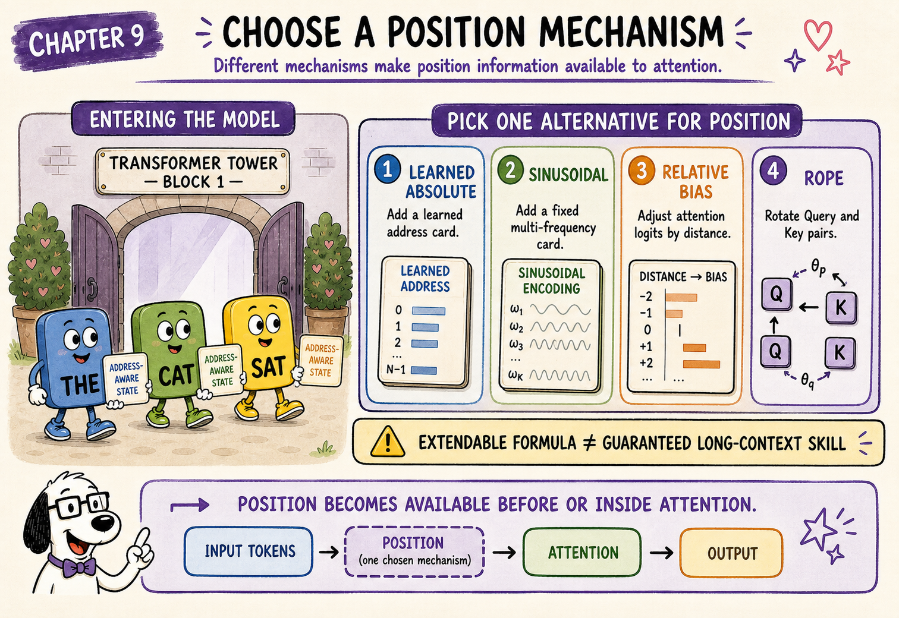

{.hero}

# The question this chapter answers

Chapters 1–8 worked with a current hidden-state matrix that was already prepared for the attention block:

$$
X=
\begin{bmatrix}
x_1\\
x_2\\
\vdots\\
x_n
\end{bmatrix}
$$

Each row belonged to one token position.

But a token embedding by itself identifies **what token it is**, not **where that token occurs**.

Without some representation of order, how can a Transformer distinguish:

> The cat chased the dog

from:

> The dog chased the cat

**Attention can compare token representations, but the model must also receive information about order. Positional mechanisms make the same token behave differently when it appears at different locations.**

# Open the position box

Chapter 1 gave us a minimum scaffold: token IDs become token embeddings, and the architecture makes position available before or inside attention. Chapters 1–8 then treated the supplied $X$ as the current hidden-state matrix already prepared for the block, rather than pausing to unpack the position mechanism.

Now we can open that labelled box. The timing is **pedagogical, not computational**. Position was not added after the block completed in Chapter 8; it entered the computation wherever the target architecture defines it.

Why teach the details now? We already understand Queries, Keys, Query–Key scores, and causal masking. That makes the architectural differences precise:

- additive methods alter the initial hidden state;
- RoPE acts directly on Query and Key coordinate pairs;
- relative-position biases alter attention logits.

We can also keep three ideas separate:

- **row alignment** is tensor bookkeeping;
- **causal visibility** controls which positions a Query may use;
- a **positional mechanism** makes location or relative distance available to learned computation.

Before the first block, a decoder-only Transformer begins with token IDs and creates token embeddings:

$$
E=
\begin{bmatrix}
e_1\\
e_2\\
\vdots\\
e_n
\end{bmatrix}
$$

It must then make position available somehow.

Common approaches include:

- learned absolute positional embeddings;
- fixed sinusoidal position encodings;
- relative-position biases;
- rotary position embeddings, usually called **RoPE**.

This list is a menu of architecture choices, not a universal pipeline in which every method is applied. A target model may use one approach or a documented combination. The shared requirement is that the computation can distinguish one ordering from another.

# Token embeddings alone do not know order

Suppose an unmasked self-attention layer receives:

$$
E=
\begin{bmatrix}
e_{\text{The}}\\
e_{\text{cat}}\\
e_{\text{sat}}
\end{bmatrix}
$$

If we reorder the rows:

$$
E'=
\begin{bmatrix}
e_{\text{sat}}\\
e_{\text{cat}}\\
e_{\text{The}}
\end{bmatrix}
$$

then ordinary self-attention without positional information produces the correspondingly reordered outputs. It is permutation-equivariant: the mechanism processes relationships among rows, but it has not been told which row is first, second, or third.

A causal mask does introduce an ordering constraint because earlier rows are allowed to see fewer positions than later rows. However, that visibility rule is not a rich representation of absolute position or relative distance.

## Causal order and positional representation are different

The causal mask answers:

> Which positions may this Query use?

A positional mechanism helps answer:

> Where is this token, and how far is it from another position?

A decoder-only model normally needs both.

# Approach 1: learned absolute positional embeddings

Start with the additive model introduced as Chapter 1's compact teaching bridge. In this architecture family, a position vector has model width and is added to the token embedding. This is one positional design, not a mandatory step that must also occur before RoPE.

One direct solution is to learn one vector for each supported position.

For position \(t\):

$$
p_t\in\mathbb{R}^{d_{\text{model}}}
$$

The initial representation is:

$$
x_t^{(0)}=e_t+p_t
$$

For the whole sequence:

$$
X^{(0)}=E+P
$$

where:

$$
P=
\begin{bmatrix}
p_1\\
p_2\\
\vdots\\
p_n
\end{bmatrix}
$$

The token embedding contributes identity. The positional embedding contributes location.

# Unpacking one additive version of our running matrix

Chapters 1–8 used the following $X^{(0)}$ as the prepared state entering the first block. They did not require us to decompose it. To make learned absolute positions concrete, suppose this particular toy matrix came from $E+P$. This is an illustrative reconstruction of the additive approach, not a claim that a RoPE-based architecture would also create $X^{(0)}$ by adding $P$.

The prepared matrix was:

$$
X^{(0)}=
\begin{bmatrix}
0.21 & -0.37 & 0.58 & -0.11\\
-0.42 & 0.73 & -0.15 & 0.36\\
0.14 & -0.22 & 0.67 & -0.31
\end{bmatrix}
$$

The rows belong to THE, CAT, and SAT.

Imagine that this matrix was produced by adding:

$$
E=
\begin{bmatrix}
0.25 & -0.30 & 0.50 & -0.05\\
-0.35 & 0.60 & -0.10 & 0.28\\
0.10 & -0.15 & 0.62 & -0.26
\end{bmatrix}
$$

and:

$$
P=
\begin{bmatrix}
-0.04 & -0.07 & 0.08 & -0.06\\
-0.07 & 0.13 & -0.05 & 0.08\\
0.04 & -0.07 & 0.05 & -0.05
\end{bmatrix}
$$

Then:

$$
X^{(0)}=E+P
$$

For CAT at position 2:

$$
\begin{aligned}
x_{\text{cat}}^{(0)}
&=e_{\text{cat}}+p_2\\
&=
\begin{bmatrix}
-0.35 & 0.60 & -0.10 & 0.28
\end{bmatrix}
+
\begin{bmatrix}
-0.07 & 0.13 & -0.05 & 0.08
\end{bmatrix}\\
&=
\begin{bmatrix}
-0.42 & 0.73 & -0.15 & 0.36
\end{bmatrix}
\end{aligned}
$$

That is exactly the CAT row used in the earlier calculations.

# The same token at a different position

The token embedding for CAT remains:

$$
e_{\text{cat}}=
\begin{bmatrix}
-0.35 & 0.60 & -0.10 & 0.28
\end{bmatrix}
$$

Suppose position 5 has:

$$
p_5=
\begin{bmatrix}
0.09 & 0.02 & -0.11 & 0.06
\end{bmatrix}
$$

Then CAT at position 5 begins with:

$$
\begin{aligned}
x_{\text{cat at }5}^{(0)}
&=e_{\text{cat}}+p_5\\
&=
\begin{bmatrix}
-0.26 & 0.62 & -0.21 & 0.34
\end{bmatrix}
\end{aligned}
$$

Therefore:

$$
x_{\text{cat at }2}^{(0)}
\neq
x_{\text{cat at }5}^{(0)}
$$

The token identity is the same. Its initial state differs because its address differs.

# Follow the additive shapes

For \(n\) positions:

$$
E\in\mathbb{R}^{n\times d_{\text{model}}}
$$

$$
P\in\mathbb{R}^{n\times d_{\text{model}}}
$$

Therefore:

$$
X^{(0)}=E+P
\in\mathbb{R}^{n\times d_{\text{model}}}
$$

The operation preserves both sequence length and model width.

# Strengths and limits of learned absolute positions

Learned absolute embeddings are simple:

- look up one token vector;
- look up one positional vector;
- add them.

They are also naturally tied to the represented position table.

If vectors were learned only for:

$$
1,2,\ldots,N
$$

there is no automatically learned vector for position \(N+1\).

Architectures can extend or interpolate such systems, but the basic learned table does not provide unlimited positions by itself.

# Approach 2: sinusoidal position encodings

The original Transformer used fixed sine and cosine functions.

For position \(p\) and feature-pair index \(i\):

$$
\operatorname{PE}(p,2i)
=
\sin\left(
\frac{p}{10000^{2i/d_{\text{model}}}}
\right)
$$

$$
\operatorname{PE}(p,2i+1)
=
\cos\left(
\frac{p}{10000^{2i/d_{\text{model}}}}
\right)
$$

Different coordinate pairs use different frequencies.

Some coordinates change quickly with position. Others change slowly.

The encoding is added to the token embedding:

$$
x_t^{(0)}=e_t+\operatorname{PE}(t)
$$

## Frequency intuition

Think of several clock hands turning at different speeds.

Fast hands help distinguish nearby positions. Slow hands retain structure over longer ranges. Together they form a distributed positional signature.

# Absolute position is not the whole story

A Query at position \(i\) compares with a Key at position \(j\):

$$
q_i\cdot k_j
$$

Many useful relationships depend on their separation:

$$
i-j
$$

Examples include:

- the immediately preceding token;
- a token five places earlier;
- the start of a nearby phrase;
- a repeated pattern at a particular distance.

This motivates methods that place relative position directly into Query–Key compatibility.

# Approach 3: rotary position embeddings

RoPE does not normally add a position vector to the hidden state.

Instead, it rotates pairs of Query and Key coordinates by position-dependent angles.

Begin with:

$$
q_t=x_tW^Q
$$

and:

$$
k_t=x_tW^K
$$

RoPE creates:

$$
\widetilde{q}_t=R_tq_t
$$

$$
\widetilde{k}_t=R_tk_t
$$

Attention then uses:

$$
\widetilde{q}_i\cdot\widetilde{k}_j
$$

# A two-dimensional rotation

For one coordinate pair, rotation by angle \(\phi\) uses:

$$
R(\phi)=
\begin{bmatrix}
\cos\phi & -\sin\phi\\
\sin\phi & \cos\phi
\end{bmatrix}
$$

At position \(m\), a frequency parameter θ gives angle:

$$
m\theta
$$

For a two-coordinate Query:

$$
q=
\begin{bmatrix}
q_1\\q_2
\end{bmatrix}
$$

its rotated form is:

$$
\widetilde{q}_m=R(m\theta)q
$$

A Key at position \(n\) is rotated using:

$$
\widetilde{k}_n=R(n\theta)k
$$

# Exact RoPE calculation

Use:

$$
q=
\begin{bmatrix}
0.8\\0.6
\end{bmatrix}
$$

and:

$$
k=
\begin{bmatrix}
0.5\\-0.4
\end{bmatrix}
$$

Let:

$$
\theta=30^\circ
$$

Place the Query at position:

$$
m=1
$$

and the Key at position:

$$
n=3
$$

The Query rotates by \(30^\circ\):

$$
\widetilde{q}_1
=
R(30^\circ)q
\approx
\begin{bmatrix}
0.392820\\0.919615
\end{bmatrix}
$$

The Key rotates by \(90^\circ\):

$$
\widetilde{k}_3
=
R(90^\circ)k
=
\begin{bmatrix}
0.4\\0.5
\end{bmatrix}
$$

Their dot product is:

$$
\begin{aligned}
\widetilde{q}_1\cdot\widetilde{k}_3
&=0.392820(0.4)+0.919615(0.5)\\
&\approx0.157128+0.459808\\
&\approx0.616936
\end{aligned}
$$

# Shift both positions together

Move both vectors one position later:

$$
m=2,\qquad n=4
$$

The separation remains:

$$
n-m=2
$$

The rotated vectors are approximately:

$$
\widetilde{q}_2
=
\begin{bmatrix}
-0.119615\\0.992820
\end{bmatrix}
$$

and:

$$
\widetilde{k}_4
=
\begin{bmatrix}
0.096410\\0.633013
\end{bmatrix}
$$

Their dot product is again:

$$
\widetilde{q}_2\cdot\widetilde{k}_4
\approx0.616936
$$

The absolute positions changed, but the relative separation did not.

# Change the relative separation

Return the Query to position 1 and place the Key at position 2:

$$
n-m=1
$$

The dot product becomes:

$$
\widetilde{q}_1\cdot\widetilde{k}_2
\approx0.448564
$$

Changing the relative distance changed the compatibility.

**RoPE injects position into Query–Key geometry. A shared shift preserves relative separation, while changing the separation changes the rotated dot product.**

# Why relative distance appears

Rotation matrices satisfy:

$$
R(a)^T R(b)=R(b-a)
$$

Therefore:

$$
\begin{aligned}
\widetilde{q}_m^T\widetilde{k}_n
&=(R(m\theta)q)^T(R(n\theta)k)\\
&=q^TR(m\theta)^TR(n\theta)k\\
&=q^TR((n-m)\theta)k
\end{aligned}
$$

The score depends on:

$$
n-m
$$

rather than requiring attention to reconstruct relative distance only from two separately added absolute vectors.

# Real RoPE uses many coordinate pairs

A real head contains many coordinates.

RoPE divides them into pairs:

$$
(q_1,q_2),
(q_3,q_4),
\ldots
$$

Each pair rotates at a different frequency.

Fast-changing pairs are sensitive to short positional differences. Slow-changing pairs vary over longer ranges.

# Why Values are normally not rotated

In the standard RoPE formulation:

- Queries are rotated;
- Keys are rotated;
- Values are not rotated.

RoPE alters matching geometry:

$$
\widetilde{Q}\widetilde{K}^T
$$

Values remain the payload mixed after attention weights are known:

$$
Z=AV
$$

## Position affects retrieval without becoming the payload

Rotating Queries and Keys changes which positions match strongly.

Values do not need the same rotation because they are not used in the compatibility dot product.

# RoPE and causal masking solve different problems

RoPE answers:

> How should position and relative distance influence Query–Key compatibility?

The causal mask answers:

> Which Key positions is this Query allowed to use?

Both operate in the same head:

$$
A=
\operatorname{softmax}
\left(
\frac{\widetilde{Q}\widetilde{K}^T}{\sqrt{d_k}}+M
\right)
$$

A future position can have a valid rotated Key and still be blocked by the mask.

# Relative-position bias: another design

Some architectures add a positional bias directly to each attention logit:

$$
L_{ij}
=
\frac{q_i\cdot k_j}{\sqrt{d_k}}
+b(i,j)
$$

The bias can depend on exact or bucketed distance.

This differs from RoPE:

- RoPE changes Queries and Keys before their dot product;
- relative-position bias adds a term after the dot product.

# Position methods compared

| Method | Where position enters | Learned? | Main intuition |
|---|---|---:|---|
| Learned absolute embedding | Added to token embedding | Yes | Each position owns a vector |
| Sinusoidal encoding | Added to token embedding | No | Multiple fixed positional frequencies |
| RoPE | Rotates Query and Key pairs | Usually formula-based | Relative distance affects dot products |
| Relative-position bias | Added to attention logits | Often | Distance directly adjusts compatibility |

Always inspect the target model rather than assuming one universal design.

# Position and context length

A model's usable context length depends on more than one formula.

Relevant factors include:

- the positional mechanism;
- sequence lengths used during training;
- attention implementation;
- available memory;
- scaling or interpolation methods;
- empirical long-context evaluation.

## Extrapolation is not automatic competence

RoPE can mathematically rotate a Query beyond the training range.

That does not prove the model learned to reason reliably there. Long-context behaviour must be trained and evaluated.

# Positional information becomes contextual

Position enters early, but it does not remain a separate label attached to the token.

After the first block, the hidden state has been transformed by:

- positional effects on attention;
- retrieved Values;
- output projection;
- residual updates;
- MLP processing.

Later layers build new Queries, Keys, and Values from these already contextual states.

# Common positional mistakes

## Mistake 1: saying attention automatically knows order

Unmasked self-attention is permutation-equivariant unless position is supplied.

## Mistake 2: treating causal masking as a complete positional representation

The mask supplies a visibility order, but it does not provide rich location and distance features.

## Mistake 3: treating position as one ordinary scalar coordinate

Production mechanisms distribute positional information across many coordinates or scores.

## Mistake 4: saying RoPE rotates token IDs

RoPE normally rotates Query and Key coordinate pairs after projection.

## Mistake 5: rotating Values in the standard explanation

Standard RoPE modifies matching, while Values remain the payload.

## Mistake 6: claiming one coordinate stores the position number

Position is represented across vector coordinates and frequencies.

## Mistake 7: claiming any computable position is reliable

Generalisation beyond trained context lengths is an empirical property.

# Checkpoint

## 1. Why are token embeddings alone insufficient?

They represent token identity but do not inherently distinguish location or ordering.

## 2. What is the additive absolute-position formula?

$$
x_t^{(0)}=e_t+p_t
$$

## 3. Does adding a positional embedding change model width?

No. Equal-width vectors are added element by element.

## 4. What does RoPE normally transform?

Pairs of Query and Key coordinates.

## 5. Why is relative position visible in the rotated dot product?

Because:

$$
R(m\theta)^TR(n\theta)=R((n-m)\theta)
$$

## 6. Are Values normally rotated in standard RoPE?

No. Values are mixed after Query–Key compatibility creates attention weights.

## 7. Does RoPE remove the need for causal masking?

No. Position representation and visibility constraints are separate.

## 8. Does an extendable position formula guarantee reliable long-context reasoning?

No. Reliability depends on training, architecture, scaling methods, and evaluation.

# Chapter takeaway

A token embedding answers:

> What token is this?

A positional mechanism helps answer:

> Where is it, and how far is it from another position?

With additive positional embeddings:

$$
X^{(0)}=E+P
$$

With RoPE:

$$
\widetilde{Q}=R(Q)
$$

$$
\widetilde{K}=R(K)
$$

and attention uses:

$$
A=
\operatorname{softmax}
\left(
\frac{\widetilde{Q}\widetilde{K}^T}{\sqrt{d_k}}+M
\right)
$$

In our story:

> **The token embedding gives each character an identity. The positional mechanism gives each character an address. Attention can then reason about both who is present and where everyone stands.**

# Coming next: carry the prepared state through depth

Chapter 1 introduced the minimum scaffold, Chapters 2–8 showed what one block does with a prepared input, and this chapter made the architecture-specific positional treatment explicit. The stack now has a well-defined starting state: $X^{(0)}$ is the prepared hidden-state matrix entering the first block.

The first block produces another matrix with the same outer shape:

$$
X^{(1)}\in\mathbb{R}^{n\times d_{\text{model}}}
$$

That output becomes the next block's input, and refinement continues:

$$
X^{(0)}
\rightarrow
X^{(1)}
\rightarrow
\cdots
\rightarrow
X^{(L)}
$$

Chapter 10 can therefore begin directly with depth: it follows the residual stream through the stack and shows why every layer owns its own attention, MLP, normalisation, and KV-cache state.
