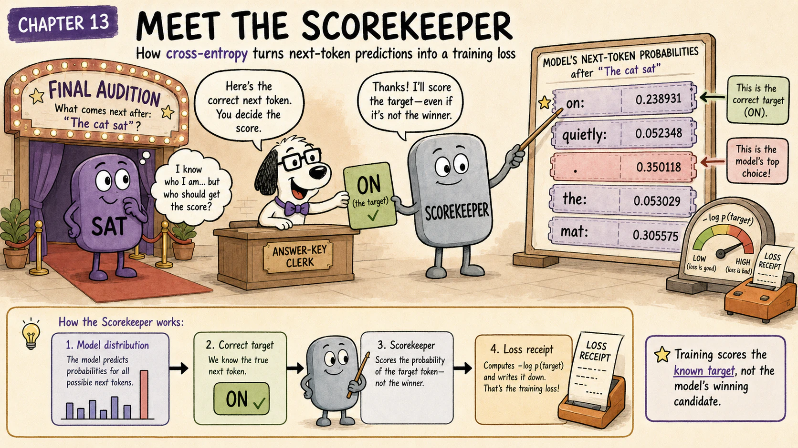
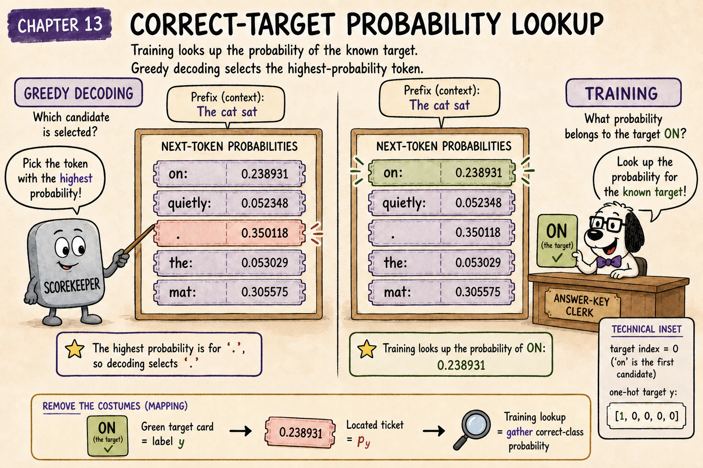
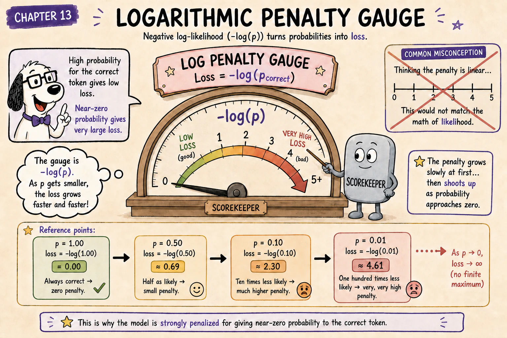
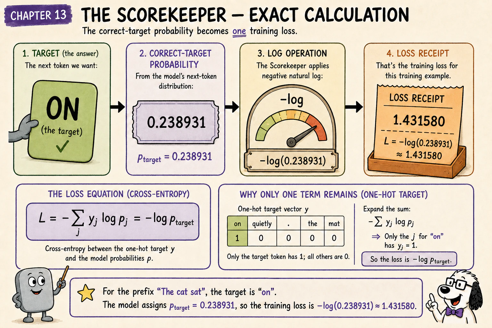
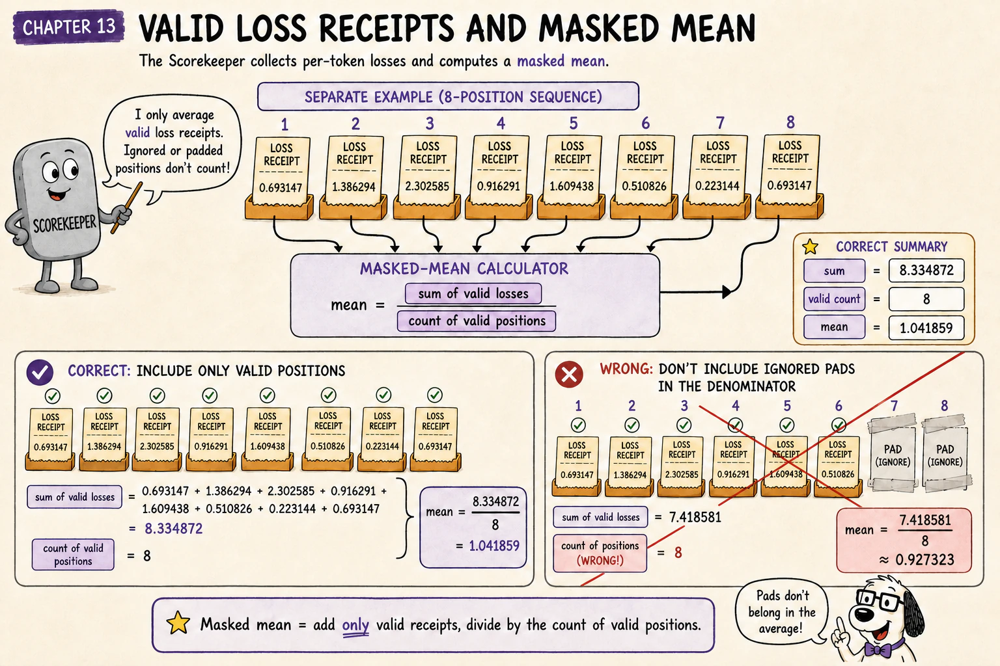
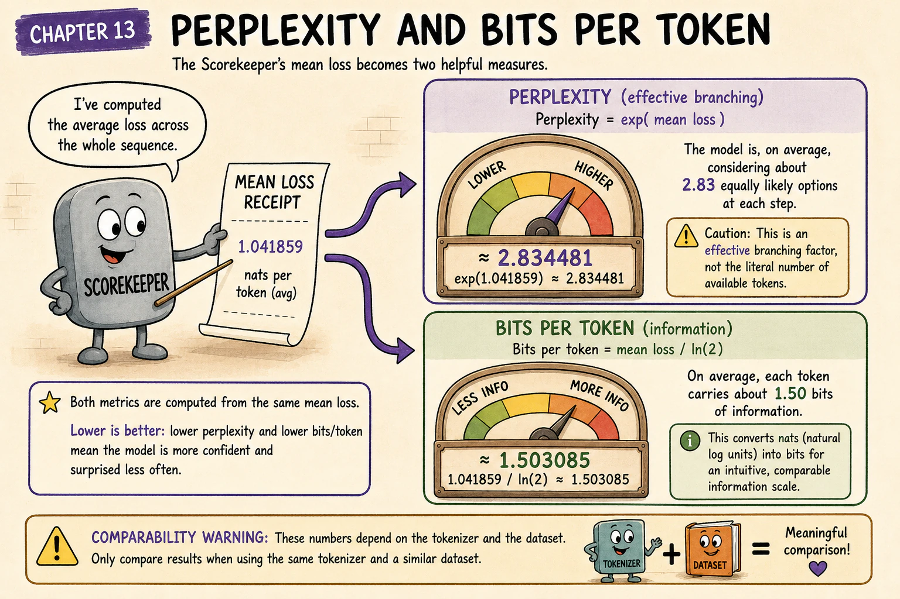
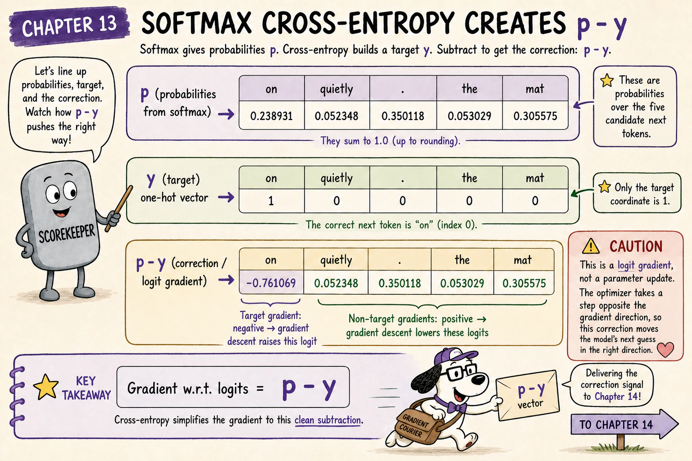
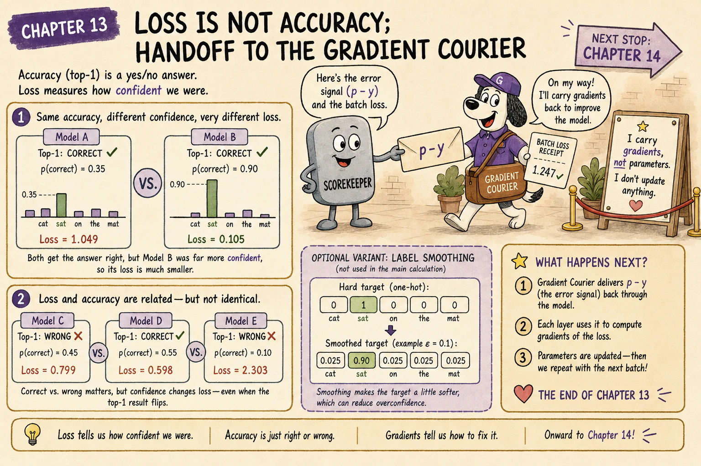

{.hero}

# The question this chapter answers

Chapter 12 created one correct target for every valid prediction row.

For example:

```text
prefix:  <BOS> The cat sat
answer:  on
```

The model returns a probability distribution over the entire vocabulary, not one isolated answer.

How do we score that distribution?

<div class="big-idea">

**Cross-entropy rewards probability assigned to the correct token. It measures not only whether the answer ranked first, but how strongly the model supported it.**

</div>

# Cold open: the scorekeeper ignores the excuses

Suppose two models both rank `on` first.

Model A assigns:

$$
p(\mathtt{on})=0.55
$$

Model B assigns:

$$
p(\mathtt{on})=0.95
$$

Top-1 accuracy calls both predictions correct.

Cross-entropy gives Model B a better score because it assigned more probability to the observed target.

For correct target \(y\):

$$
\mathcal{L}=-\log p_y
$$



# Negative log-likelihood for one target

Using natural logarithms:

| Correct-target probability | Loss |
|---:|---:|
| 1.00 | 0.000000 |
| 0.80 | 0.223144 |
| 0.50 | 0.693147 |
| 0.25 | 1.386294 |
| 0.10 | 2.302585 |
| 0.01 | 4.605170 |

The pattern is deliberate:

- high correct-token probability gives low loss;
- low correct-token probability gives high loss;
- probability 1 gives zero loss;
- probability approaching zero produces a very large penalty.



# Why use a logarithm?

If the model assigns correct-token probabilities:

$$
p_1,p_2,\ldots,p_T
$$

then the autoregressive likelihood of the observed sequence contains their product:

$$
\prod_{i=1}^{T}p_i
$$

Taking the negative logarithm converts that product into a sum:

$$
-\log\left(\prod_{i=1}^{T}p_i\right)
=
-\sum_{i=1}^{T}\log p_i
$$

Sums are easier to accumulate, average, and differentiate than long products of small numbers.

The logarithm also penalises confident mistakes strongly and makes minimising loss equivalent to maximising the observed data likelihood.

# Return to Chapter 11's distribution

Chapter 11 produced this distribution after the prefix:

> The cat sat

| Token | Probability |
|---|---:|
| `on` | 0.238931 |
| `quietly` | 0.052348 |
| `.` | 0.350118 |
| `the` | 0.053029 |
| `mat` | 0.305575 |

The training text says the correct next token is:

$$
y=\mathtt{on}
$$

Therefore:

$$
\begin{aligned}
\mathcal{L}_{\mathrm{sat}}
&=-\log p(\mathtt{on})\\
&=-\log(0.238931)\\
&\approx1.431580
\end{aligned}
$$



The period had the highest model probability, but the target is `on`.

The loss uses the probability assigned to the target—not the probability assigned to the model's favourite candidate.

<div class="warning">

## The loss uses the target, not the argmax

Training does not choose one token first and then mark that discrete selection right or wrong.

The full distribution remains differentiable. The target ID identifies which probability appears inside the negative logarithm.

</div>

# From one-hot targets to cross-entropy

For vocabulary size \(V\), define the target vector:

$$
y_j=
\begin{cases}
1, & j=\mathrm{correct\ token}\\
0, & \mathrm{otherwise}
\end{cases}
$$

Categorical cross-entropy is:

$$
\mathcal{L}
=
-\sum_{j=1}^{V}y_j\log p_j
$$

Only the correct class has \(y_j=1\), so:

$$
\mathcal{L}=-\log p_y
$$

For one-hot next-token targets, categorical cross-entropy and negative log-likelihood are two views of the same per-position objective.

# Cross-entropy starts from logits in software

The model directly produces logits:

$$
z_1,z_2,\ldots,z_V
$$

Softmax gives:

$$
p_j
=
\frac{e^{z_j}}{\sum_{r=1}^{V}e^{z_r}}
$$

Substitution gives:

$$
\begin{aligned}
\mathcal{L}
&=-\log\left(
\frac{e^{z_y}}{\sum_r e^{z_r}}
\right)\\
&=-z_y+\log\left(\sum_r e^{z_r}\right)
\end{aligned}
$$

Libraries commonly combine log-softmax and negative log-likelihood into one numerically stable operation.

# Stable log-sum-exp

Large logits can overflow when exponentiated.

Let:

$$
m=\max_j z_j
$$

Then:

$$
\log\left(\sum_j e^{z_j}\right)
=
m+
\log\left(\sum_j e^{z_j-m}\right)
$$

Subtracting the largest logit keeps all exponentials at or below 1 without changing the final probabilities or loss.

# Score every valid position

Chapter 12 introduced this separate eight-position illustration:

| Position | Correct target | Correct-target probability | Per-position loss |
|---:|---|---:|---:|
| 0 | `The` | 0.50 | 0.693147 |
| 1 | `cat` | 0.25 | 1.386294 |
| 2 | `sat` | 0.10 | 2.302585 |
| 3 | `on` | 0.40 | 0.916291 |
| 4 | `the` | 0.20 | 1.609438 |
| 5 | `mat` | 0.60 | 0.510826 |
| 6 | `.` | 0.80 | 0.223144 |
| 7 | `<EOS>` | 0.50 | 0.693147 |

The total negative log-likelihood is:

$$
\begin{aligned}
\mathcal{L}_{\mathrm{sum}}
&=
0.693147+1.386294+2.302585+0.916291\\
&\quad+1.609438+0.510826+0.223144+0.693147\\
&\approx8.334872
\end{aligned}
$$

# Mean token loss

With eight valid targets:

$$
\begin{aligned}
\mathcal{L}_{\mathrm{mean}}
&=
\frac{8.334872}{8}\\
&\approx1.041859
\end{aligned}
$$

The focused Chapter 11 example and this full-sequence table are deliberately different forward-pass illustrations. The focused example preserves Chapter 11's exact probability; the table makes the reduction across positions easy to inspect.

# Masked cross-entropy

Let:

$$
m_{b,i}\in\{0,1\}
$$

mark whether target \(i\) in batch item \(b\) is valid.

The masked mean is:

$$
\mathcal{L}_{\mathrm{batch}}
=
\frac{
\sum_{b,i}m_{b,i}\mathcal{L}_{b,i}
}{
\sum_{b,i}m_{b,i}
}
$$

The denominator counts valid targets, not padded tensor slots.



# Reduction choices affect scale

A loss function may return:

- one value per position;
- the sum of valid losses;
- the mean of valid losses.

These are often called `none`, `sum`, and `mean` reductions.

Doubling batch size doubles a summed loss but need not double a properly averaged loss. Learning-rate choices and metric comparisons must account for the reduction convention.

# Perplexity

For mean cross-entropy measured in natural-log units:

$$
\operatorname{PPL}
=e^{\mathcal{L}_{\mathrm{mean}}}
$$

For the eight-position example:

$$
\begin{aligned}
\operatorname{PPL}
&=e^{1.041859}\\
&\approx2.834481
\end{aligned}
$$

Lower perplexity means the model assigned more probability to the observed targets.

A useful intuition is an **equivalent uniform branching factor**. A perplexity near 2.83 has the same average negative log-likelihood as repeatedly finding the answer among about 2.83 equally likely options.

That does not mean the model literally considered exactly 2.83 tokens at every position.

# Perplexity is not accuracy

| Model | Correct-token probability | Top-1 result | Loss |
|---|---:|---|---:|
| A | 0.35 | Correct | 1.049822 |
| B | 0.90 | Correct | 0.105361 |

Accuracy treats the two as equal.

Cross-entropy distinguishes their confidence.

A model can also put 0.40 on the correct token and 0.41 on an incorrect token. Top-1 accuracy is wrong, while loss still recognises the substantial target probability.

# Compare perplexity carefully

Perplexity depends on the evaluation setup and tokenisation.

The most direct comparisons use:

- the same tokenizer or equivalent unit;
- the same evaluation text;
- the same boundary and mask rules;
- the same log base and reduction convention.

A lower token-level perplexity under a different tokenizer does not automatically prove better language modelling.

# Bits per token

Natural-log loss is measured in nats.

The equivalent number of bits per token is:

$$
\operatorname{bits/token}
=
\frac{\mathcal{L}_{\mathrm{mean}}}{\log 2}
$$

For the eight-position example:

$$
\operatorname{bits/token}
\approx1.503085
$$



# Label smoothing changes the target

The basic target is one-hot.

Some objectives assign most, but not all, target mass to the correct class. For smoothing amount \(arepsilon\), one possible rule is:

$$
y_y=1-\varepsilon
$$

with the remaining mass distributed over other classes.

Label smoothing changes the objective and gradient. It is not part of the basic calculation in this chapter, and not every LLM pretraining recipe uses it.

# The gradient signal begins at the logits

For softmax probabilities \(p_j\) and one-hot target \(y_j\):

$$
\frac{\partial\mathcal{L}}{\partial z_j}
=p_j-y_j
$$

For the correct token:

$$
\frac{\partial\mathcal{L}}{\partial z_y}
=p_y-1
$$

This is negative whenever \(p_y<1\), so gradient descent tends to raise the correct token's logit.

For an incorrect token:

$$
\frac{\partial\mathcal{L}}{\partial z_j}
=p_j
$$

Gradient descent tends to lower incorrectly supported logits in proportion to their probabilities.

# Exact logit gradient for Chapter 11

Chapter 11 produced:

$$
p
\approx
\begin{bmatrix}
0.238931 & 0.052348 & 0.350118 & 0.053029 & 0.305575
\end{bmatrix}
$$

The target `on` is the first vocabulary entry:

$$
y=
\begin{bmatrix}
1 & 0 & 0 & 0 & 0
\end{bmatrix}
$$

Therefore:

$$
\boxed{
\frac{\partial\mathcal{L}}{\partial z}
=p-y
\approx
\begin{bmatrix}
-0.761069 & 0.052348 & 0.350118 & 0.053029 & 0.305575
\end{bmatrix}
}
$$



The negative component for `on` requests upward pressure on its logit.

The largest positive incorrect component belongs to the period because the model assigned the period the most incorrect probability.

<div class="translation">

## Read the gradient as a correction request

- `on`: raise this score;
- `.`: lower this score strongly;
- `mat`: lower this score;
- low-probability alternatives: make smaller corrections.

The gradient does not manually edit logits. It flows to the parameters that produced them.

</div>

# Loss is not a complete quality measure

Low next-token cross-entropy does not by itself guarantee:

- factual accuracy;
- harmlessness;
- instruction following;
- calibrated uncertainty;
- long-horizon coherence;
- usefulness for a specific task.

Those properties depend on data, architecture, optimisation, post-training, decoding, and evaluation.

# Common loss mistakes

## Mistake 1: using the highest probability instead of the target probability

The loss always scores the observed target.

## Mistake 2: averaging over padding

Only valid positions should normally enter the numerator and denominator.

## Mistake 3: taking argmax before calculating loss

Argmax discards the differentiable distribution.

## Mistake 4: manually applying softmax before a logits-based combined loss

Many libraries expect raw logits and perform stable log-softmax internally.

## Mistake 5: treating perplexity as accuracy

Perplexity measures predictive likelihood, not only top-1 correctness.

## Mistake 6: comparing incompatible tokenizers without qualification

Different token units can make raw perplexities misleading.

## Mistake 7: forgetting the reduction convention

Summed and averaged losses have different scales.

## Mistake 8: saying loss directly changes weights

Backpropagation calculates gradients; an optimiser applies updates.



# Checkpoint

<div class="exercise">

## 1. What is the per-token negative log-likelihood?

$$
-\log p_y
$$

## 2. What happens as \(p_y\rightarrow1\)?

The loss approaches zero.

## 3. What happens as \(p_y\rightarrow0\)?

The loss grows without bound.

## 4. What is the mean loss in the eight-position example?

Approximately 1.041859 nats per valid token.

## 5. What is its perplexity?

Approximately 2.834481.

## 6. Why use a one-hot target in the basic formulation?

Exactly one vocabulary token is the observed next token at that position.

## 7. What is the logit gradient for softmax cross-entropy?

$$
p-y
$$

## 8. Why is the correct token's logit gradient normally negative?

Its component is \(p_y-1\).

## 9. Does low perplexity guarantee factual correctness?

No.

## 10. Why mask padding positions?

They are tensor fillers rather than genuine language targets.

</div>

# Chapter takeaway

For target \(y\):

$$
\mathcal{L}=-\log p_y
$$

Across \(N\) valid positions:

$$
\mathcal{L}_{\mathrm{mean}}
=
\frac{1}{N}
\sum_{i=1}^{N}-\log p_{i,y_i}
$$

Perplexity is:

$$
\operatorname{PPL}=e^{\mathcal{L}_{\mathrm{mean}}}
$$

The derivative at the logits is:

$$
\frac{\partial\mathcal{L}}{\partial z}=p-y
$$

In our story:

> **The Scorekeeper looks at how much support the model gave the real next token. Confident support earns a small penalty; confident rejection earns a large one.**

# Coming next: the blame travels backward

We now have a scalar loss and an exact correction signal at the vocabulary logits.

The next chapter follows that signal through:

- the vocabulary projection;
- the final hidden state;
- residual paths;
- MLPs and attention;
- shared parameters;
- a gradient-based update.
