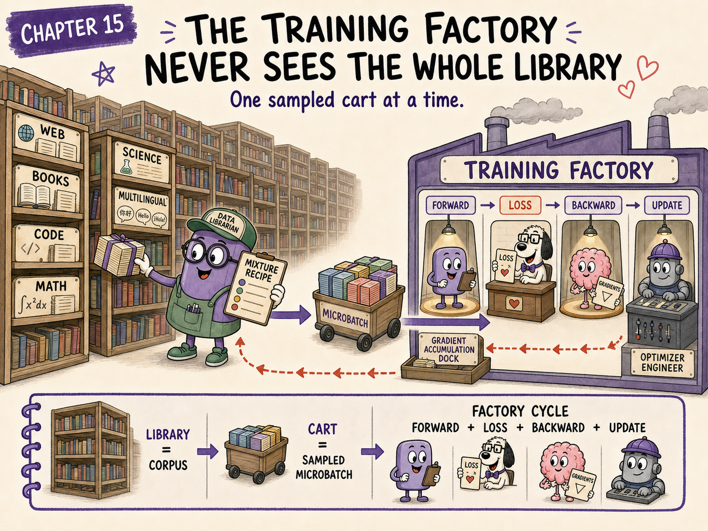
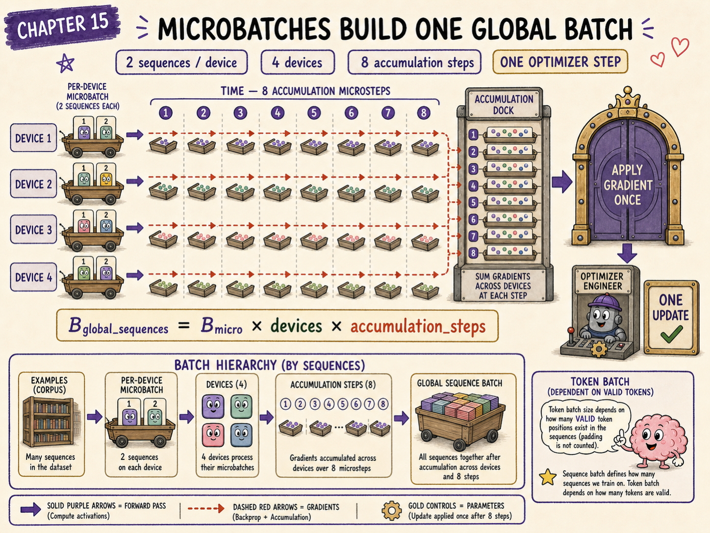
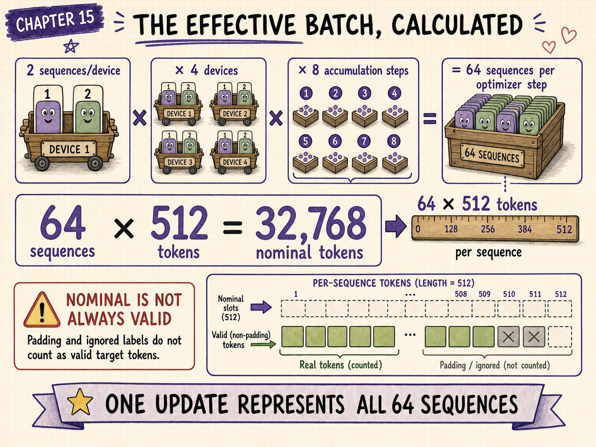
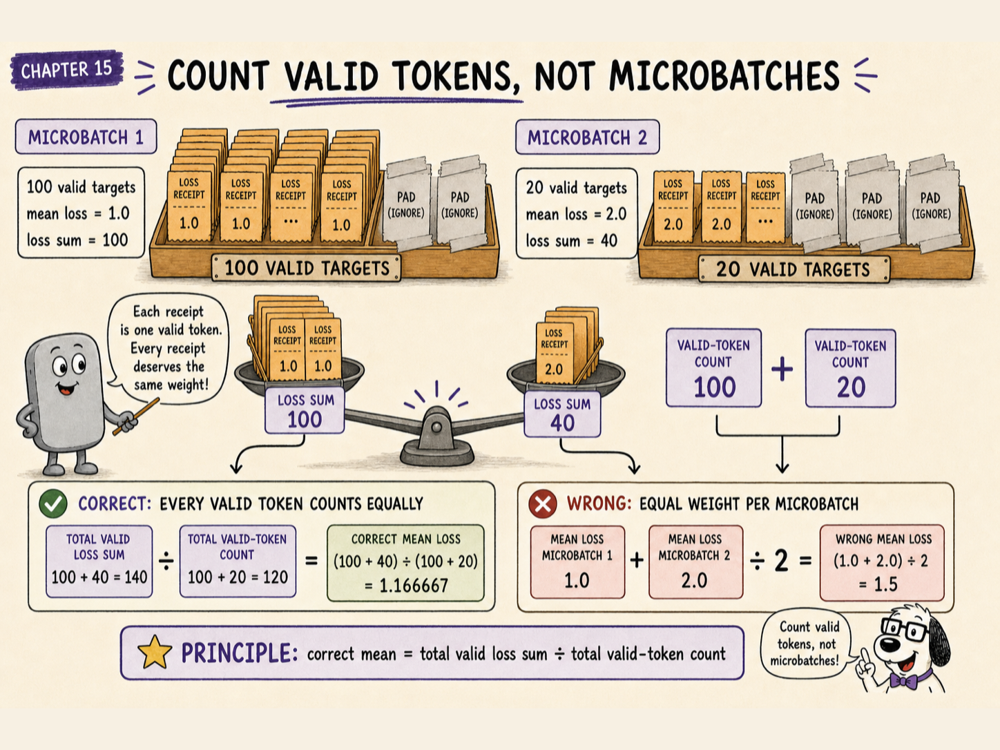
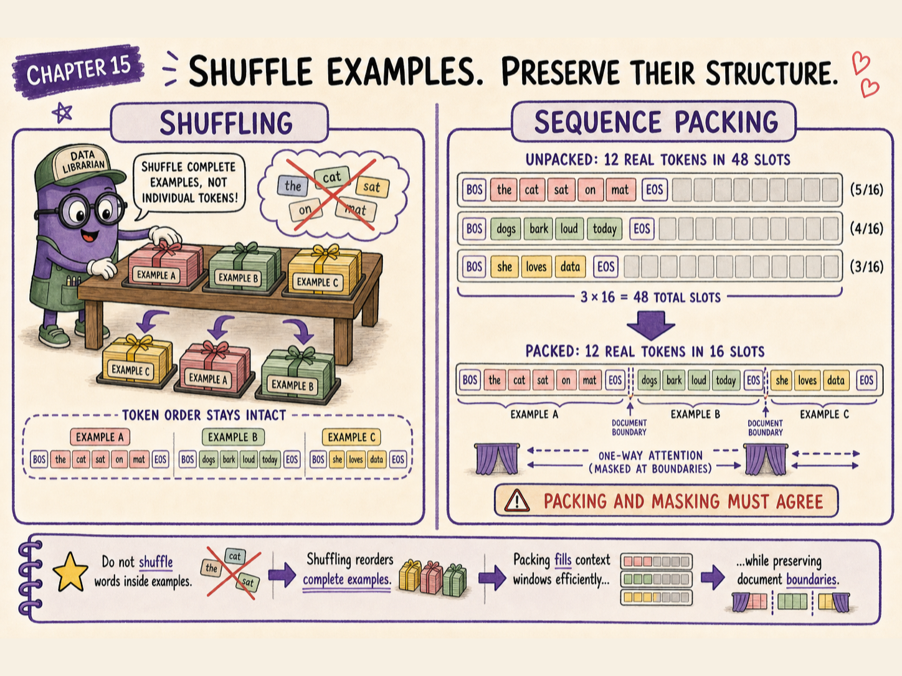
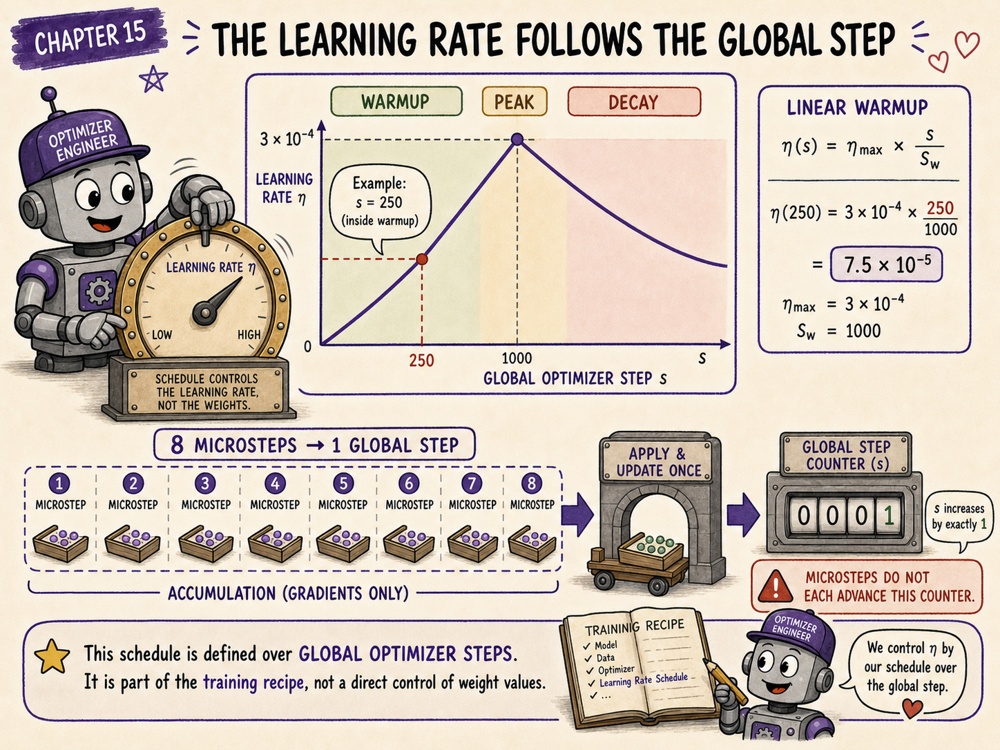
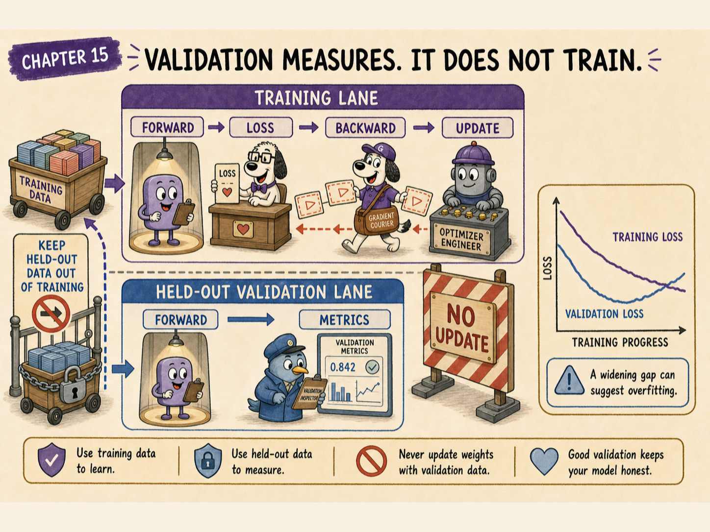
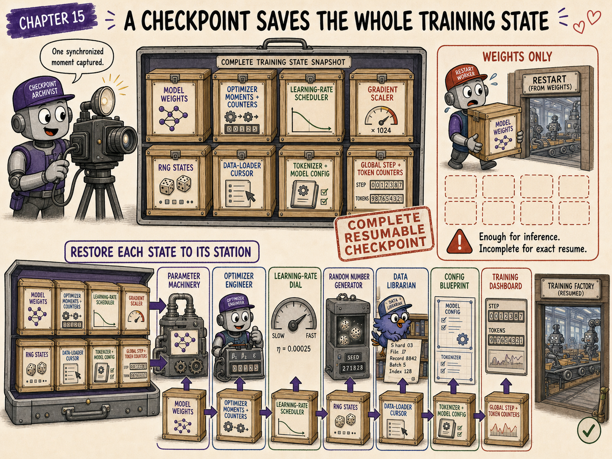
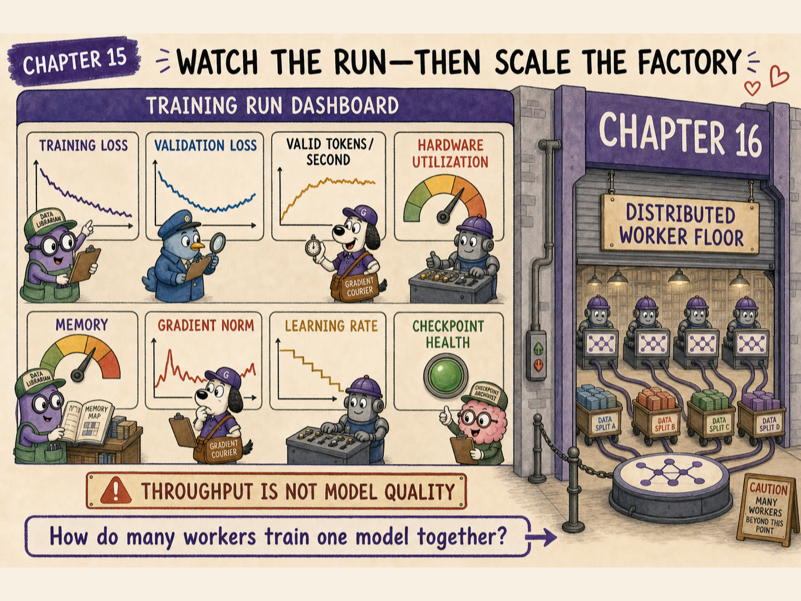

# The question this chapter answers

Chapter 14 followed one loss backward and changed one parameter.

Real language-model training repeats that process across enormous collections of token sequences.

But the complete training corpus cannot be loaded into one accelerator at once. Often, even one desired batch cannot fit into memory at once.

How does a training system organise data, combine many small pieces into one optimiser step, vary the learning rate, measure progress, and recover after interruption?

<div class="big-idea">

**A training run is a carefully controlled stream of token batches. Each step samples data, computes a mean loss, accumulates gradients, updates parameters, validates progress, and periodically saves enough state to continue faithfully.**

</div>



# Cold open: the model attends one shift at a time

Imagine a library containing billions of tokens.

The model does not read the complete library and then update once.

Instead, the training factory repeatedly performs a cycle:

```text
select token sequences
        -> build shifted targets and masks
        -> forward pass
        -> mean loss over valid target tokens
        -> backward pass
        -> optimiser step
        -> repeat
```

Every update sees only a small sample of the available corpus.

Over many steps, those samples provide enough evidence to shape shared parameters.

# Examples, sequences, and tokens are different units

Training reports often use several batch units.

## Document or example

An original item in the dataset, such as an article, source file, conversation, or book passage.

## Sequence

A fixed or bounded window of tokens presented to the model in one forward pass.

One long document can produce several sequences. Several short documents can be packed into one sequence.

## Token

One tokenizer output position.

For language models, token count is often the clearest measure of training work because sequences can have different lengths.

<div class="warning">

## “Batch size 32” is incomplete

It may mean 32 sequences, 32 examples, or 32 items per device. Without sequence length, device count, and gradient accumulation, it does not reveal how many tokens contribute to one optimiser step.

</div>

# Local batch, microbatch, and global batch



Suppose each accelerator processes:

- \(B_{\mathrm{device}}\) sequences per forward pass;
- each sequence contains \(S\) token positions;
- there are \(D\) data-parallel workers;
- gradients accumulate over \(A\) microsteps.

The number of sequence slots contributing to one optimiser step is:

$$
B_{\mathrm{global}}
=
B_{\mathrm{device}}DA
$$

If every sequence has \(S\) valid token positions, the approximate token batch is:

$$
N_{\mathrm{tokens}}
=
B_{\mathrm{device}}DAS
$$

Padding and masked labels can reduce the number of valid targets.

# A complete effective-batch calculation



Suppose:

$$
B_{\mathrm{device}}=2
$$

$$
D=4
$$

$$
A=8
$$

and:

$$
S=512
$$

Then the optimiser step combines:

$$
B_{\mathrm{global}}
=2\cdot4\cdot8
=64
$$

sequence slots.

The nominal token count is:

$$
N_{\mathrm{tokens}}
=2\cdot4\cdot8\cdot512
=32768
$$

So the factory performs eight forward-and-backward microsteps before one optimiser update, and that update represents as many as 32,768 token positions.

# Gradient accumulation preserves memory, not computation

Gradient accumulation can make a large effective batch fit into limited memory.

```text
clear gradients
microstep 1 -> forward -> backward -> add gradients
microstep 2 -> forward -> backward -> add gradients
...
microstep 8 -> forward -> backward -> add gradients
optimiser step
clear gradients
```

Only one microbatch's activations need to remain live at a time.

However, all eight forward and backward computations still occur. Accumulation saves peak activation memory; it does not eliminate arithmetic.

# Mean the loss consistently



Suppose microbatch \(m\) contains \(N_m\) valid target tokens and token-loss sum \(L_m\).

The correct effective-batch mean is:

$$
\mathcal{L}_{\mathrm{batch}}
=
\frac{\sum_m L_m}{\sum_m N_m}
$$

Simply averaging microbatch means can be wrong when microbatches contain different numbers of valid labels.

For example, consider:

| Microbatch | Valid targets | Mean loss | Loss sum |
|---:|---:|---:|---:|
| 1 | 100 | 1.0 | 100 |
| 2 | 20 | 2.0 | 40 |

The unweighted average of microbatch means is:

$$
\frac{1.0+2.0}{2}=1.5
$$

But the valid-token mean is:

$$
\frac{100+40}{100+20}
=
1.166667
$$

The second value gives every valid target equal weight.

# Shuffle without losing structure



Training data should not always arrive in the same highly correlated order.

Shuffling helps mix topics and sources across updates. Yet language-model data pipelines must preserve structure where it matters:

- token order inside a document;
- document boundaries when cross-document attention is disallowed;
- role boundaries in conversations;
- source metadata used for filtering or weighting.

The pipeline shuffles examples or sequence units, not the tokens inside a sentence.

# Packing short examples

Padding wastes computation because padded positions do not provide useful targets.

Suppose the context length is 16, but three examples contain 5, 4, and 3 tokens.

Processing each separately uses:

$$
3\cdot16=48
$$

sequence slots for only:

$$
5+4+3=12
$$

real tokens.

Packing can place several examples into one context window:

```text
example A | boundary | example B | boundary | example C
```

A correct implementation must decide whether attention can cross those boundaries and must build masks accordingly.

Packing improves utilisation, but incorrect boundaries can create training examples the data policy never intended.

# Data mixtures shape what the model practises

A pretraining corpus may combine sources such as:

- general web text;
- books and articles;
- source code;
- mathematics;
- scientific material;
- multilingual text;
- curated high-quality collections.

If source \(k\) is sampled with probability \(q_k\), then:

$$
\sum_k q_k=1
$$

The sampling probabilities need not equal raw corpus proportions.

A small high-quality source may be upsampled. A huge repetitive source may be downsampled.

<div class="translation">

## The curriculum is partly in the sampler

The optimiser can only learn from examples the data pipeline presents. Changing the mixture changes the distribution of practice, even when the architecture and objective remain unchanged.

</div>

# Epochs become less intuitive at large scale

An epoch traditionally means one pass through the dataset.

For a fixed corpus containing \(N\) tokens and a run that processes \(R\) training tokens:

$$
\mathrm{epochs}
=
\frac{R}{N}
$$

But large language-model training may involve:

- streaming datasets;
- weighted resampling;
- repeated high-quality subsets;
- filtered or regenerated shards;
- corpora so large that one complete pass is not the most useful unit.

Training-token count and optimiser-step count are therefore often more informative than epoch count alone.

# One optimiser step is not one example

With the earlier effective batch:

$$
N_{\mathrm{tokens}}=32768
$$

After 10,000 optimiser steps, the nominal processed-token count is:

$$
32768\cdot10000
=
327680000
$$

or about 327.68 million token positions before accounting for ignored labels or repeated samples.

# The learning rate changes during training



Chapter 14 used one fixed learning rate to expose the update sign.

Practical training commonly uses a schedule.

A frequent pattern is:

1. warm up from a small learning rate;
2. reach a peak value;
3. decay over the remaining steps.

# Linear warmup

Let:

- \(s\) be the current optimiser step;
- \(S_w\) be the number of warmup steps;
- \(\eta_{\max}\) be the peak learning rate.

During warmup:

$$
\eta(s)
=
\eta_{\max}\frac{s}{S_w}
\qquad
0\le s\le S_w
$$

If:

$$
\eta_{\max}=3\cdot10^{-4}
$$

and:

$$
S_w=1000
$$

then at step 250:

$$
\eta(250)
=
3\cdot10^{-4}\frac{250}{1000}
=
7.5\cdot10^{-5}
$$

Warmup avoids applying the full step size before optimiser statistics and representations have stabilised.

# Cosine decay

After warmup, one possible schedule is cosine decay.

Let total planned steps be \(S\). For \(s>S_w\), define progress:

$$
u
=
\frac{s-S_w}{S-S_w}
$$

with \(0\le u\le1\).

A cosine schedule from \(\eta_{\max}\) toward \(\eta_{\min}\) is:

$$
\eta(s)
=
\eta_{\min}
+
\frac{1}{2}
(\eta_{\max}-\eta_{\min})
[1+\cos(\pi u)]
$$

At \(u=0\), the rate is \(\eta_{\max}\). At \(u=1\), it reaches \(\eta_{\min}\).

The exact schedule is a training-recipe choice, not a requirement of the Transformer architecture.

# Training loss is not enough



Training loss is measured on data used to compute updates.

A model can improve its training loss while becoming worse at generalising to unseen examples.

A validation set is held out from parameter updates. Periodically, the model runs forward passes on that set and reports metrics such as:

- validation cross-entropy;
- validation perplexity;
- task-specific evaluation scores;
- source-specific losses.

No backward pass or optimiser update should use the validation examples during ordinary evaluation.

# Watch the gap, not only the direction

Possible patterns include:

| Training loss | Validation loss | Possible interpretation |
|---|---|---|
| Falling | Falling | General learning is improving |
| Falling | Flat | Additional updates may have diminishing general benefit |
| Falling | Rising | Overfitting, distribution mismatch, or data-quality issues may be growing |
| Unstable | Unstable | Optimisation or numerical problems may be present |

A single metric cannot diagnose every cause, but the relationship between training and validation is informative.

# Prevent validation contamination

Validation is misleading when its examples also appear in training.

Contamination can occur through:

- duplicate documents;
- mirrored websites;
- benchmark questions copied into the corpus;
- train and validation slices taken after poor deduplication;
- generated data that reproduces held-out material.

Deduplication and provenance tracking are part of evaluation quality, not merely storage hygiene.

# Checkpoints freeze a complete training state



A useful training checkpoint normally includes more than model weights.

To resume faithfully, save:

- model parameters;
- optimiser moments and step counters;
- learning-rate scheduler state;
- gradient-scaler state for mixed precision;
- random-number-generator states;
- data-loader or shard position;
- training configuration and tokenizer identity;
- progress counters and metadata.

Saving only model weights allows inference, but it may not reproduce the next training step.

# Why optimiser state matters

AdamW maintains moving statistics for every trained parameter.

If weights are restored but those moments are reset, the resumed optimiser behaves differently from the interrupted run.

The model starts from the same parameter values but not from the same optimisation state.

# Why the data cursor matters

Suppose a streaming job stops after consuming part of a shard.

Without restoring the data position, a resumed run may:

- repeat recent examples;
- skip unseen examples;
- change the mixture schedule;
- break reproducibility.

Exact reproducibility can still be difficult in distributed systems, but checkpointing the data state reduces avoidable drift.

# Checkpoint frequency is a trade-off

Saving often reduces lost work after failure, but checkpoints consume:

- storage bandwidth;
- filesystem or object-store capacity;
- training time;
- coordination across workers.

A practical policy may keep:

- recent rolling checkpoints;
- less frequent long-term checkpoints;
- selected checkpoints with strong validation results.

# A complete training-run loop

```text
initialise model, optimiser, schedule, and data stream

repeat until token or step budget is exhausted:
    collect one or more microbatches
    create shifted targets and masks
    run forward and backward passes
    reduce or accumulate gradients
    unscale and clip when required
    apply optimiser update
    advance learning-rate schedule

    periodically:
        evaluate held-out data
        log losses, throughput, and stability signals
        save a resumable checkpoint
```

# Throughput and utilisation

Training systems also monitor operational measures such as:

- valid tokens processed per second;
- time per optimiser step;
- accelerator utilisation;
- communication time;
- input-pipeline stalls;
- memory headroom;
- invalid gradients or skipped steps.

A mathematically correct training loop can still waste most hardware time while waiting for data or communication.

# Common training-run mistakes

## Mistake 1: reporting sequence batch without token count

Sequence length can change the amount of work dramatically.

## Mistake 2: averaging unequal microbatches equally

Loss and gradient scaling should reflect the intended valid-token weighting.

## Mistake 3: assuming accumulation makes training cheaper

It reduces peak memory but still performs every microstep.

## Mistake 4: shuffling tokens inside examples

Shuffling should mix examples or sequence units while preserving linguistic order.

## Mistake 5: allowing packed examples to attend across forbidden boundaries

Packing and masking must agree.

## Mistake 6: treating raw corpus proportions as automatically optimal

Sampling weights are part of the model's curriculum.

## Mistake 7: using training loss as the only quality signal

Held-out evaluation is required to measure generalisation.

## Mistake 8: saving only model weights for a training restart

Optimiser, schedule, random state, and data position also matter.

## Mistake 9: changing the learning rate without recording the schedule

The schedule is part of the experiment definition.

## Mistake 10: comparing runs with different token budgets as if they saw equal data

Step count alone can hide different effective batch sizes and sequence lengths.

# Checkpoint

<div class="exercise">

## 1. What is the global sequence batch for 2 sequences per device, 4 devices, and 8 accumulation steps?

$$
2\cdot4\cdot8=64
$$

## 2. At sequence length 512, what is the nominal token batch?

$$
64\cdot512=32768
$$

## 3. What does gradient accumulation primarily reduce?

Peak activation memory required for the effective batch.

## 4. Why can averaging microbatch means be wrong?

Microbatches can contain different counts of valid target tokens.

## 5. What does data-mixture sampling control?

How often the model practises examples from each source distribution.

## 6. Why use learning-rate warmup?

To avoid immediately applying the peak step size during the unstable beginning of optimisation.

## 7. Does validation loss produce an optimiser update?

Not during ordinary held-out evaluation.

## 8. Why save optimiser state?

Adaptive optimiser moments and counters influence future updates.

## 9. Why save a data cursor?

To reduce skipped or repeated data after resuming.

## 10. Is one epoch always the clearest measure for LLM pretraining?

No. Weighted streaming mixtures and huge corpora often make processed-token count more informative.

</div>

# Chapter takeaway

One optimiser step may combine many devices and microsteps:

$$
B_{\mathrm{global}}
=
B_{\mathrm{device}}DA
$$

The training run repeatedly samples data, computes a valid-token mean loss, accumulates gradients, applies a scheduled update, validates on held-out data, and saves resumable state.

In our story:

> **The model never receives the whole library at once. The training factory delivers carefully mixed pages in measured batches, adjusts the teaching pace, checks an unseen exam, and bookmarks every state needed to continue.**

# Coming next: the factory needs more than one machine



Even a well-designed batch may not fit on one accelerator, and a large model's parameters and optimiser state can exceed one device's memory.

Chapter 16 explains how workers share data, parameters, layers, activations, gradients, and communication.
