# The question this chapter answers

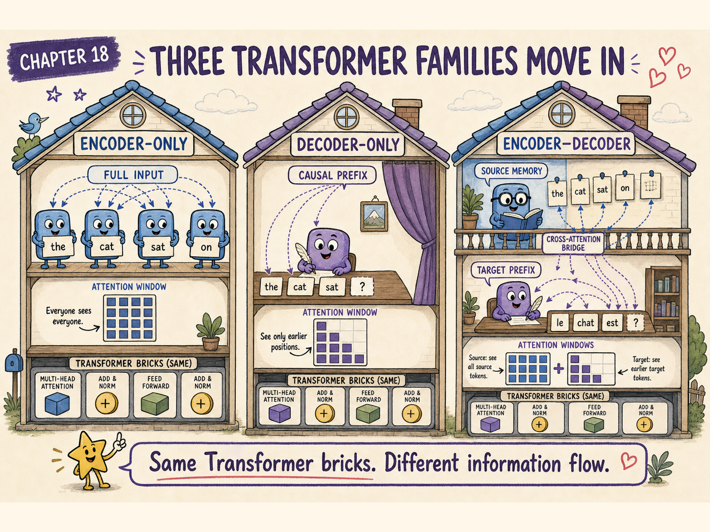{.hero}

By now, we have followed one decoder-style Transformer from token representations through attention, generation, training, and post-training.

But not every Transformer is built for the same job.

Some models read an entire input before producing a representation. Some generate one token at a time. Some first build a source-side memory and then generate while consulting it.

How do encoder-only, decoder-only, and encoder–decoder models differ, and which publicly documented models belong to each family?

<div class="big-idea">

**The three families use many of the same building blocks, but they impose different information-flow rules. Those rules determine what each token may see, what objective is natural, and which tasks the architecture handles most directly.**

</div>

# Meet the three houses

Imagine three neighbouring houses built from familiar Transformer rooms.

```text
ENCODER-ONLY HOUSE
all tokens read the whole input
        ↓
contextual representation for every position

DECODER-ONLY HOUSE
one token sees only earlier permitted tokens
        ↓
next-token distribution

ENCODER–DECODER HOUSE
source is encoded first
        ↓
decoder writes while consulting source memory
```

The distinction is not mainly about parameter count.

It is about the attention pattern and the role assigned to the hidden states.

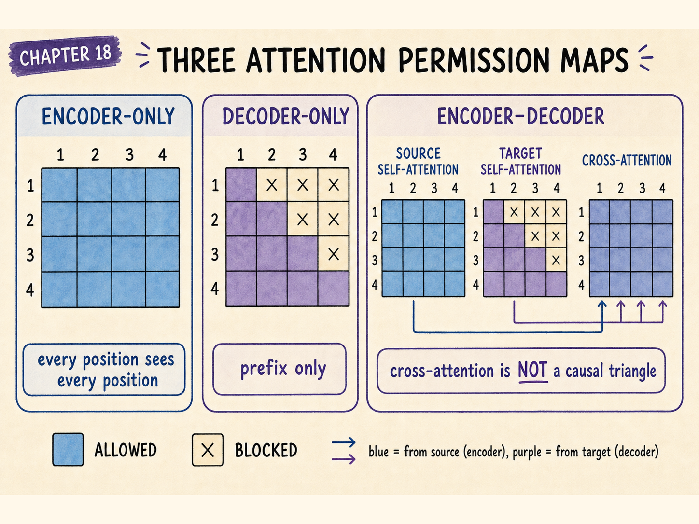

# Family 1: encoder-only models

An encoder-only model applies bidirectional self-attention across an input sequence.

For a four-token input, the attention-permission matrix can be written as:

$$
M_{\mathrm{enc}}
=
\begin{bmatrix}
1&1&1&1\\
1&1&1&1\\
1&1&1&1\\
1&1&1&1
\end{bmatrix}
$$

Every position may use information from every other non-padding position.

The word at position 2 can use both left and right context while producing its representation.

## Why bidirectional context is useful

Suppose the input is:

```text
The bank approved the loan.
```

The representation of `bank` can use `approved` and `loan` to move toward the financial sense.

In:

```text
The hikers rested beside the bank.
```

right-side context pushes the same token toward the river-edge sense.

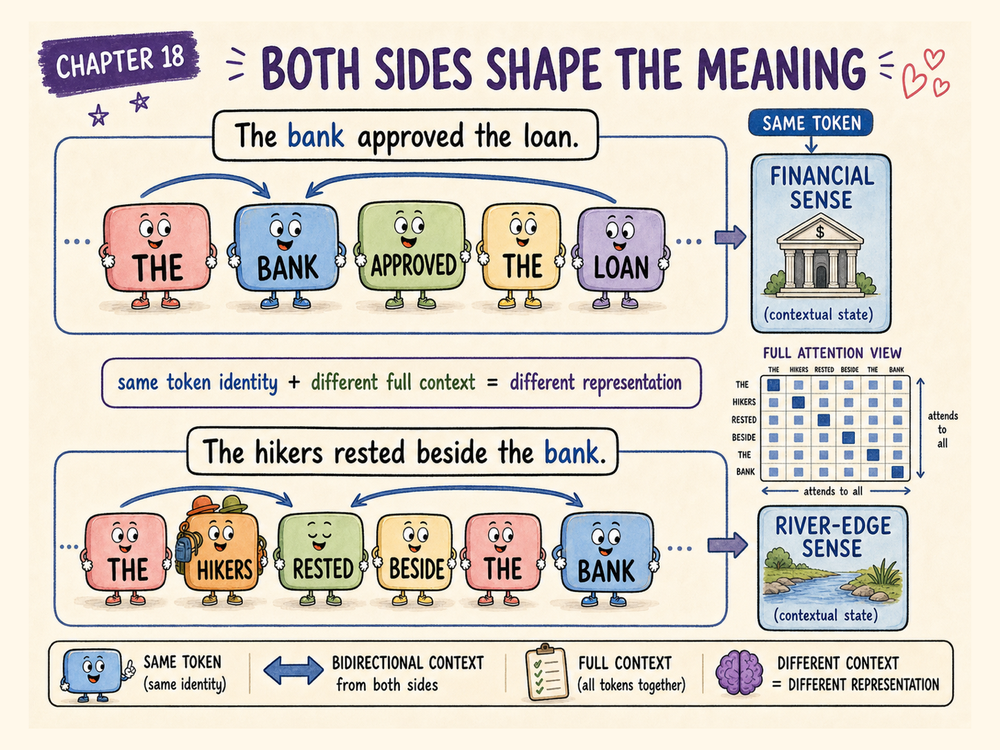

Encoder-only models are therefore natural representation builders.

They commonly produce:

- one contextual vector per token;
- a pooled sequence vector;
- embeddings for retrieval or clustering;
- token labels for tasks such as named-entity recognition;
- class probabilities for sentiment, topic, or intent.

# Encoder-only pretraining objectives

The classic BERT objective hides selected input tokens and asks the model to reconstruct them from surrounding context.

Conceptually:

```text
The cat [MASK] on the mat.
             ↓
           sat
```

Let the masked positions be selected by a mask $m_i$.

A simplified masked-language-model loss is:

$$
\mathcal{L}_{\mathrm{MLM}}
=
-\frac{1}{\sum_i m_i}
\sum_i m_i
\log p_\theta(x_i\mid x_{\setminus i})
$$

Only selected target positions receive direct loss, although all visible tokens contribute context.

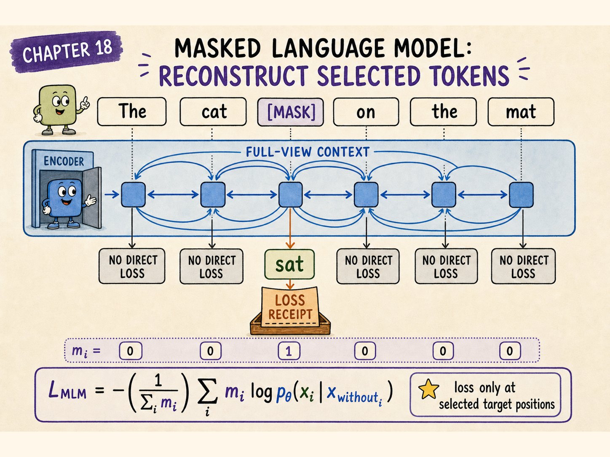

Modern encoder training recipes vary. They may alter masking, replacement strategy, data, position handling, sequence length, or auxiliary objectives. The defining architectural point remains bidirectional encoding rather than autoregressive generation.

# Real encoder-only examples

Publicly documented examples include:

| Model | Family | Characteristic use |
|---|---|---|
| BERT | Encoder-only | General bidirectional language representations |
| RoBERTa | Encoder-only | Robustly trained BERT-style representations |
| DeBERTa | Encoder-only | Disentangled attention representations |
| ModernBERT | Encoder-only | Modernised long-context encoder workloads |

These models are commonly adapted for classification, tagging, retrieval, reranking, semantic similarity, and embeddings.

<div class="warning">

## Encoder-only does not mean incapable of producing text

An application can place a prediction head on an encoder and output labels or reconstructed tokens. The important distinction is that a standard encoder is not naturally organised as a left-to-right autoregressive generator.

</div>

# Family 2: decoder-only models

A decoder-only model uses causal self-attention.

For four positions:

$$
M_{\mathrm{dec}}
=
\begin{bmatrix}
1&0&0&0\\
1&1&0&0\\
1&1&1&0\\
1&1&1&1
\end{bmatrix}
$$

Position $i$ may attend only to positions at or before $i$.

This prevents a token from reading the future token it is supposed to predict.

The training objective is usually next-token prediction:

$$
\mathcal{L}_{\mathrm{causal}}
=
-\frac{1}{T}
\sum_{t=1}^{T}
\log p_\theta(x_t\mid x_{<t})
$$

At inference time, the same machinery is reused repeatedly:

```text
prompt
  -> predict one token
  -> append it
  -> predict the next token
  -> repeat
```

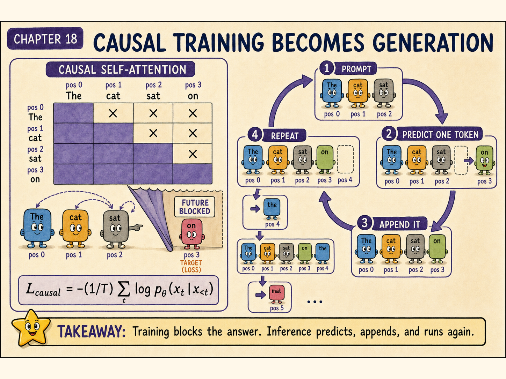

# Why decoder-only models dominate open-ended generation

The architecture directly trains the behaviour required at generation time.

It naturally supports:

- continuation;
- dialogue after chat-format post-training;
- code generation;
- structured output;
- tool-call generation;
- in-context examples;
- long-form autoregressive composition.

Its weakness is also visible in the mask: a representation at an early position cannot use later context inside the same forward pass.

For many generation tasks, that is acceptable because the model is predicting the sequence in order.

# Real decoder-only examples

Publicly documented examples include:

| Model | Family | Characteristic use |
|---|---|---|
| GPT-3 | Decoder-only | Autoregressive text completion and in-context learning |
| Llama 3 | Decoder-only | General text generation and adapted chat models |
| Mistral 7B | Decoder-only | Efficient autoregressive generation |
| Gemma | Decoder-only | Open-weight text generation and adaptation |

A base decoder-only checkpoint and an instruction-tuned checkpoint may share the same architecture while behaving very differently.

Architecture tells us how information flows. Post-training tells us which behaviour the model has practised.

# Family 3: encoder–decoder models

An encoder–decoder model divides the work.

The encoder reads a source sequence using bidirectional self-attention.

The decoder generates a target sequence using:

1. causal self-attention over the target prefix;
2. cross-attention into the encoder outputs;
3. position-wise processing and output prediction.

```text
source tokens
     ↓
encoder self-attention
     ↓
source memory: K and V
     ↑
decoder cross-attention
     ↑
decoder causal self-attention over target-so-far
```

This is a natural architecture for conditional generation.

The model does not need to squeeze the source and target into one undifferentiated causal stream. It first builds a full source representation, then generates while consulting that representation.

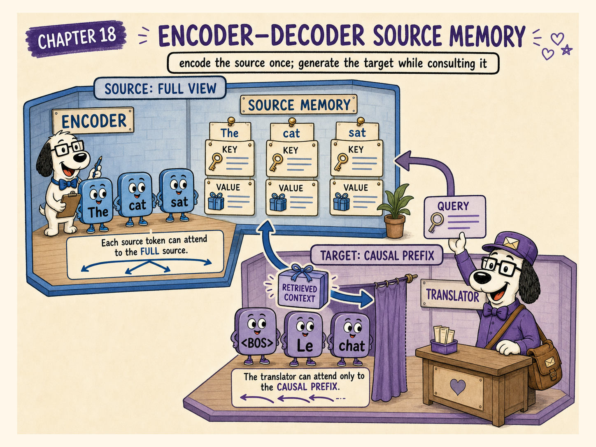

# Encoder–decoder training

Suppose the source is an English sentence and the target is its French translation.

The encoder may read the complete English sentence.

The decoder is trained with teacher forcing on the shifted French target:

```text
source:   The cat sat.
input:    <BOS> Le chat
labels:   Le    chat s'est ...
```

The conditional objective is:

$$
\mathcal{L}_{\mathrm{seq2seq}}
=
-\sum_t
\log p_\theta(y_t\mid y_{<t},x)
$$

Here $x$ is the encoded source and $y_{<t}$ is the target prefix.

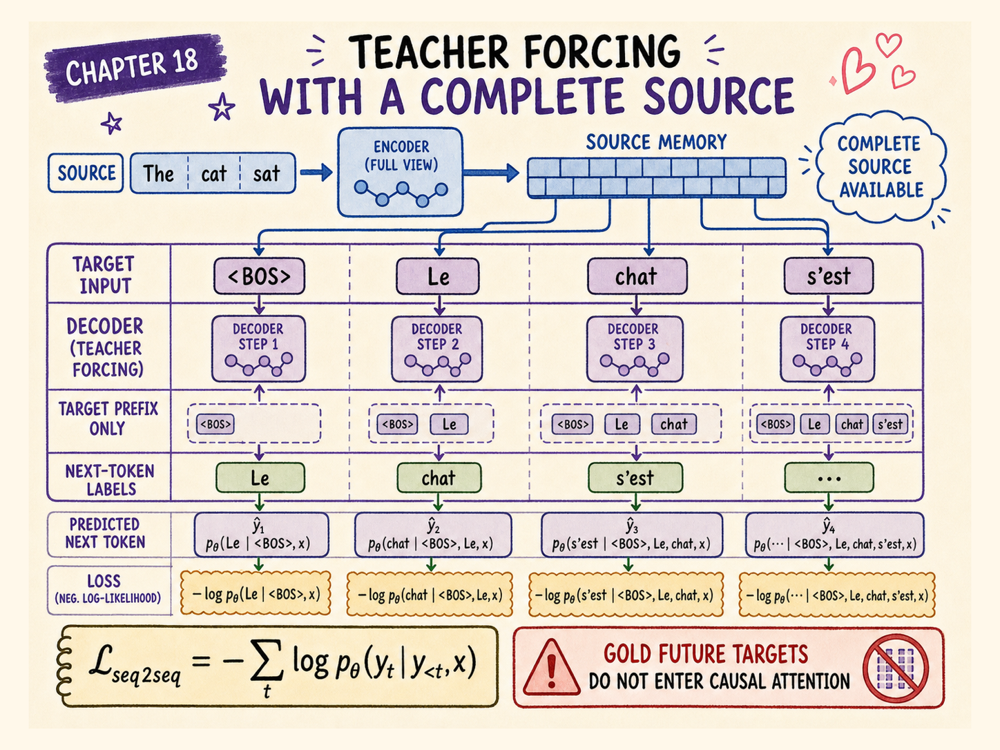

# Real encoder–decoder examples

| Model | Family | Characteristic use |
|---|---|---|
| Original Transformer | Encoder–decoder | Neural machine translation |
| T5 | Encoder–decoder | Text-to-text transfer across many tasks |
| BART | Encoder–decoder | Denoising pretraining and conditional generation |
| Whisper | Audio encoder–text decoder | Speech recognition and translation |

Whisper reminds us that the encoder input does not have to be text. It can encode audio features while the decoder generates text tokens.

# The same word “decoder” can mislead

The decoder in an encoder–decoder Transformer has two attention systems:

```text
causal self-attention
    target prefix looks at target prefix

cross-attention
    target-side Queries inspect source-side Keys and Values
```

A decoder-only model ordinarily lacks the separate encoder memory and the corresponding encoder–decoder cross-attention sublayer.

Both are called decoders, but their internal block layouts are not identical.

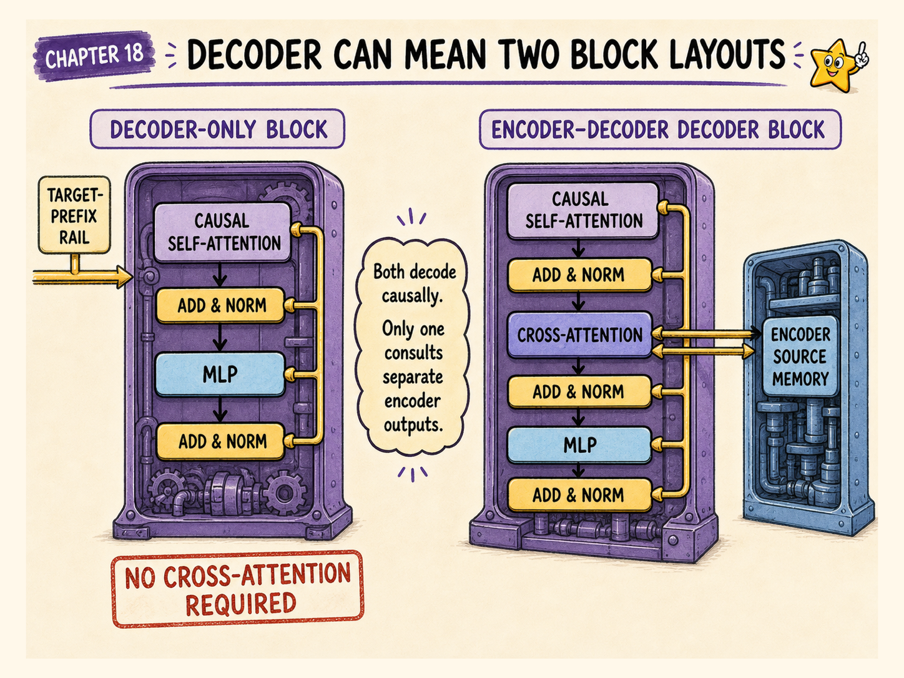

# A side-by-side comparison

| Question | Encoder-only | Decoder-only | Encoder–decoder |
|---|---|---|---|
| What does self-attention see? | Full input | Permitted prefix | Encoder: full source; decoder: target prefix |
| Separate source memory? | No | No | Yes |
| Natural objective | Masked or representation learning | Next-token prediction | Conditional sequence generation |
| Natural output | Representations or labels | Generated continuation | Generated output conditioned on source |
| Typical strengths | Understanding, embedding, ranking | Open-ended generation | Translation, summarisation, transcription |
| Typical limitation | Not naturally autoregressive | Early states lack future context | More moving parts and source–target interface |

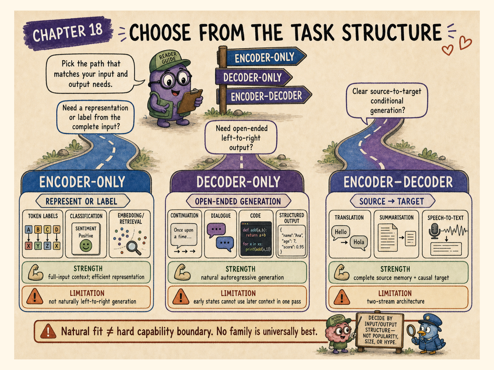

# A task-selection field guide

## Choose encoder-only when

- the complete input is available before prediction;
- you need one label or embedding for the whole input;
- you need a label for each token;
- bidirectional context is central;
- low-latency scoring or reranking matters more than free-form generation.

## Choose decoder-only when

- the output is an open-ended sequence;
- prompting and in-context examples are important;
- one architecture should support completion, chat, code, and structured generation;
- generation can proceed left to right.

## Choose encoder–decoder when

- there is a clear source and target;
- the model should read the full source before generating;
- source and target may use different modalities or tokenisations;
- explicit source memory and cross-attention are useful.

# Architecture is not destiny

Data, objective, scale, tokenizer, context length, optimisation, and post-training can matter as much as the family name.

A small decoder-only model may be weaker at classification than a specialised encoder.

A sufficiently capable decoder-only model can perform classification by generating a label.

An encoder–decoder model can be prompted in a text-to-text format to solve tasks that appear to be understanding rather than generation.

The family identifies a strong inductive bias, not a hard boundary on all possible behaviour.

# Foundation model is a different axis

“Encoder-only,” “decoder-only,” and “encoder–decoder” describe architecture.

“Foundation model” describes a broadly trained model intended to support many downstream adaptations or applications.

A foundation model can use any of these architecture families.

Likewise:

- `base model` describes a stage or checkpoint;
- `instruction-tuned model` describes adaptation;
- `chat model` describes practised interaction behaviour;
- `multimodal model` describes supported input or output modalities.

These labels answer different questions.

# Do not guess undisclosed architectures

Some commercial model providers publish detailed architecture reports. Others do not.

When the internals are not sufficiently documented, the accurate category is:

> **Architecture not publicly confirmed.**

A model’s conversational behaviour is not proof that it is decoder-only. A model can expose a chat interface while hiding an encoder, routing system, retrieval layer, or multimodal subsystem.

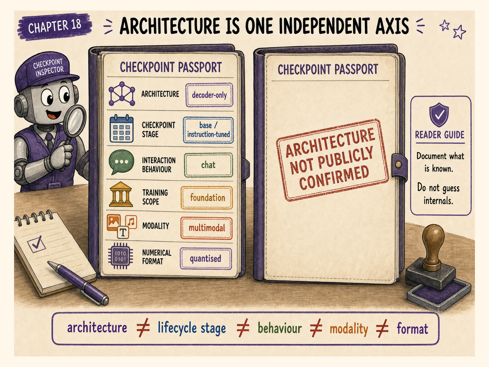

# Common architecture-family mistakes

## Mistake 1: calling every Transformer an LLM decoder

Transformers include encoders, decoders, encoder–decoders, vision encoders, audio encoders, and hybrids.

## Mistake 2: saying an encoder sees “the future” during generation

A standard encoder consumes a completed input. It is not cheating on a left-to-right target unless the training task is incorrectly constructed.

## Mistake 3: treating masked language modelling as autoregressive generation

Masked reconstruction predicts selected missing positions from surrounding context. Causal language modelling predicts the next token from a prefix.

## Mistake 4: assuming chat means encoder–decoder

Chat is a data format and behaviour. Many chat models are decoder-only.

## Mistake 5: putting cross-attention inside every decoder-only block

Standard decoder-only language models use causal self-attention. Encoder–decoder cross-attention requires a separate source memory.

## Mistake 6: classifying proprietary models from marketing language

Use architecture claims only when supported by reliable public documentation.

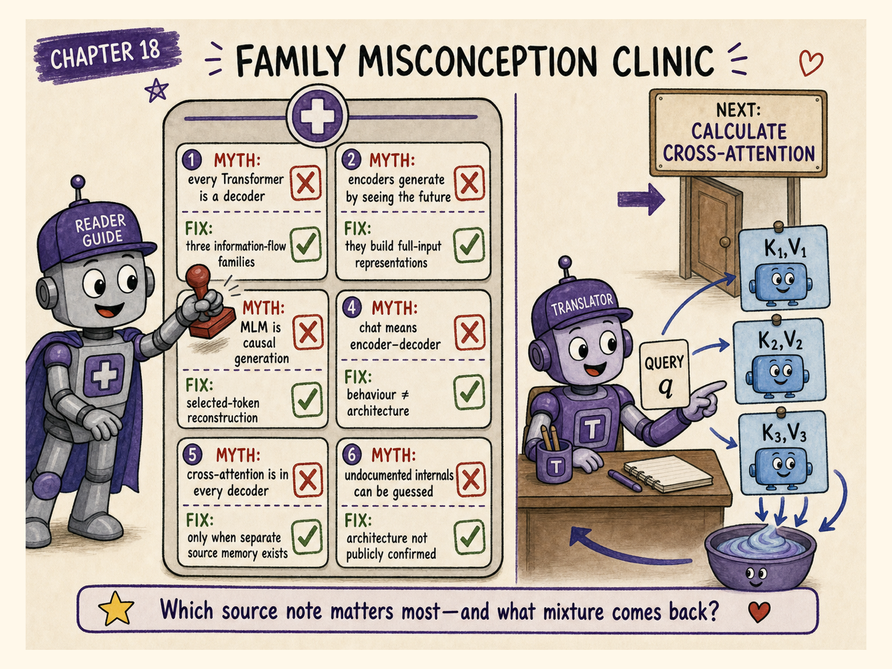

# Checkpoint

<div class="exercise">

## 1. Which family naturally builds a bidirectional representation of every input token?

Encoder-only.

## 2. Which mask prevents a token from attending to later target positions?

A causal or lower-triangular mask.

## 3. Which family contains a separate source encoder and target decoder?

Encoder–decoder.

## 4. Where do cross-attention Keys and Values come from in an encoder–decoder model?

From encoder outputs.

## 5. Is BERT naturally a left-to-right generator?

No. It is an encoder-only bidirectional representation model.

## 6. Is GPT-3 publicly documented as autoregressive?

Yes. It is a decoder-style autoregressive language model.

## 7. Is Whisper purely decoder-only?

No. It uses an audio encoder and a text decoder.

## 8. Does “foundation model” specify the attention mask?

No. It describes broad training and downstream adaptability, not one architecture.

## 9. Can a decoder-only model perform classification?

Yes. It can generate a class label, although a specialised encoder may be more direct or efficient.

## 10. What should the book say when architecture details are not public?

“Architecture not publicly confirmed.”

</div>

# Chapter takeaway

Encoder-only models build bidirectional representations.

Decoder-only models generate autoregressively under a causal mask.

Encoder–decoder models encode a source and generate a target while consulting source memory.

In our story:

> **The Encoder is the researcher who reads the whole brief. The Decoder-only writer drafts from everything written so far. The Encoder–Decoder team lets a writer produce one line at a time while repeatedly consulting the researcher’s complete notes.**

# Coming next: the decoder consults the source

The next chapter opens the encoder–decoder house and follows one exact cross-attention calculation from decoder Query to encoder Keys, softmax weights, encoder Values, and retrieved context.

# Further reading

- [Attention Is All You Need](https://arxiv.org/abs/1706.03762)
- [BERT: Pre-training of Deep Bidirectional Transformers for Language Understanding](https://arxiv.org/abs/1810.04805)
- [Language Models are Few-Shot Learners](https://arxiv.org/abs/2005.14165)
- [Exploring the Limits of Transfer Learning with a Unified Text-to-Text Transformer](https://arxiv.org/abs/1910.10683)
- [Robust Speech Recognition via Large-Scale Weak Supervision](https://arxiv.org/abs/2212.04356)
