# The question this chapter answers

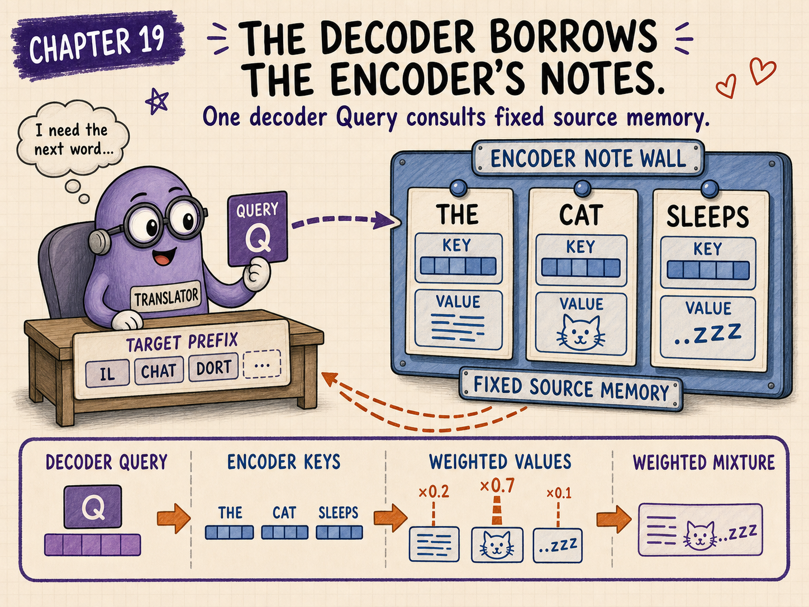{.hero}

In self-attention, Queries, Keys, and Values are projected from the same sequence of hidden states.

Cross-attention breaks that symmetry.

The decoder is writing one target token at a time, but it needs information from a separate source sequence that the encoder has already read.

How does a decoder position ask a question of the encoder memory and retrieve a source-aware answer?

<div class="big-idea">

**In encoder–decoder cross-attention, decoder hidden states create the Queries. Encoder outputs create the Keys and Values. The dot products decide which source positions matter, and the weighted Value sum carries source information back into the decoder.**

</div>

# The Translator and the wall of notes

Imagine a Translator drafting a sentence at a desk.

Behind the desk is a wall of source-language notes prepared by the Encoder.

For every target position, the Translator does two different things:

1. reads the target prefix using causal self-attention;
2. consults the source-note wall using cross-attention.

```text
target prefix
    ↓
decoder causal self-attention
    ↓
decoder hidden state
    ↓ creates Query
cross-attention ────────────────┐
    ↑                           │
encoder outputs create Keys and Values
    ↑
source sequence
```

The two attention sublayers have different jobs.

# Self-attention and cross-attention are not interchangeable

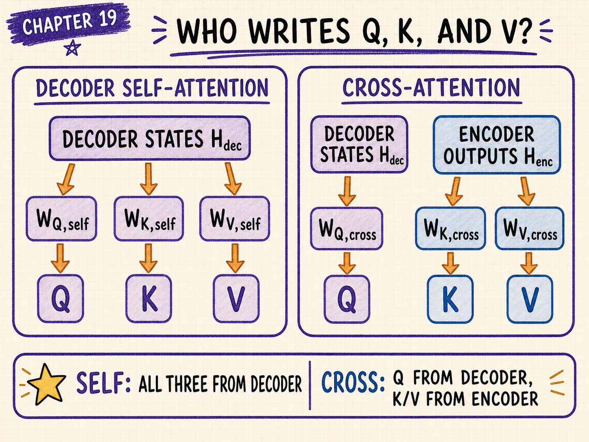

For decoder self-attention:

$$
Q_{\mathrm{self}}=H_{\mathrm{dec}}W^Q_{\mathrm{self}}
$$

$$
K_{\mathrm{self}}=H_{\mathrm{dec}}W^K_{\mathrm{self}}
$$

$$
V_{\mathrm{self}}=H_{\mathrm{dec}}W^V_{\mathrm{self}}
$$

All three come from decoder hidden states.

For cross-attention:

$$
Q_{\mathrm{cross}}=H_{\mathrm{dec}}W^Q_{\mathrm{cross}}
$$

but:

$$
K_{\mathrm{cross}}=H_{\mathrm{enc}}W^K_{\mathrm{cross}}
$$

$$
V_{\mathrm{cross}}=H_{\mathrm{enc}}W^V_{\mathrm{cross}}
$$

The Query comes from the decoder side. The Keys and Values come from the encoder side.

That source split is the defining fact of cross-attention.

# Shape bookkeeping

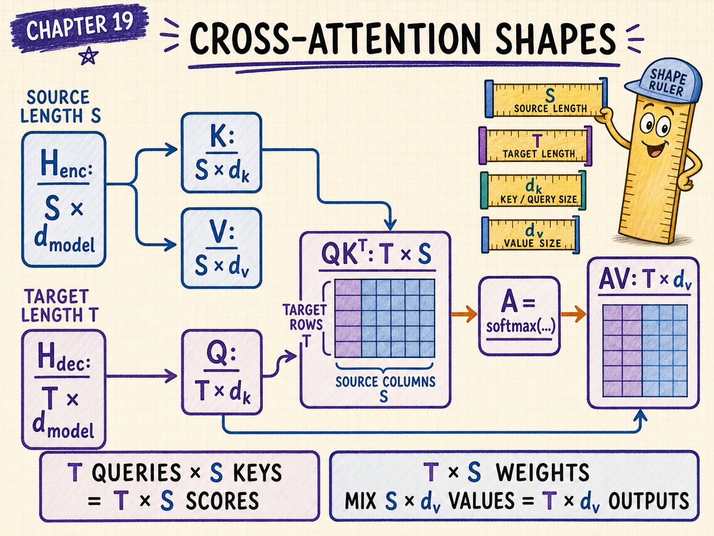

Let:

- source length be $S$;
- target length be $T$;
- model width be $d_{\mathrm{model}}$;
- attention-head width be $d_k$;
- Value width be $d_v$.

Then:

$$
H_{\mathrm{enc}}
\in
\mathbb{R}^{S\mathbin{×}d_{\mathrm{model}}}
$$

$$
H_{\mathrm{dec}}
\in
\mathbb{R}^{T\mathbin{×}d_{\mathrm{model}}}
$$

The projected tensors are:

$$
Q
\in
\mathbb{R}^{T\mathbin{×}d_k}
$$

$$
K
\in
\mathbb{R}^{S\mathbin{×}d_k}
$$

$$
V
\in
\mathbb{R}^{S\mathbin{×}d_v}
$$

The score matrix is:

$$
QK^T
\in
\mathbb{R}^{T\mathbin{×}S}
$$

Every row corresponds to one target position.

Every column corresponds to one source position.

# The full cross-attention equation

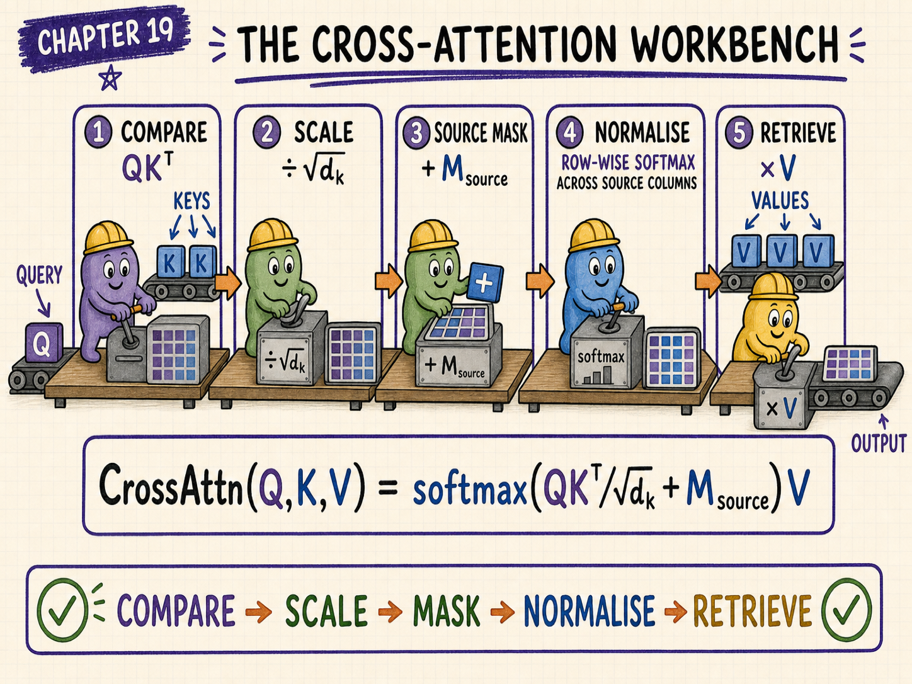

Ignoring multi-head reshaping for the moment:

$$
\operatorname{CrossAttention}(Q,K,V)
=
\operatorname{softmax}
\left(
\frac{QK^T}{\sqrt{d_k}}+M_{\mathrm{source}}
\right)V
$$

The source mask blocks padding or otherwise forbidden source positions.

Unlike decoder causal self-attention, ordinary encoder–decoder cross-attention does not need a lower-triangular target mask over source positions. A target token may usually inspect the complete encoded source.

# A one-position numerical example

Suppose the encoder has produced notes for three source tokens:

```text
source position 0: THE
source position 1: CAT
source position 2: SLEEPS
```

At one decoder position, the projected Query is:

$$
q
=
\begin{bmatrix}
0.2&0.9
\end{bmatrix}
$$

The encoder-side Keys are:

$$
K
=
\begin{bmatrix}
0.8&0.1\\
0.2&1.1\\
-0.4&0.5
\end{bmatrix}
$$

The encoder-side Values are:

$$
V
=
\begin{bmatrix}
0.7&-0.2\\
0.1&0.8\\
-0.3&0.6
\end{bmatrix}
$$

Here:

$$
d_k=2
$$

# Step 1: compare the decoder Query with every encoder Key

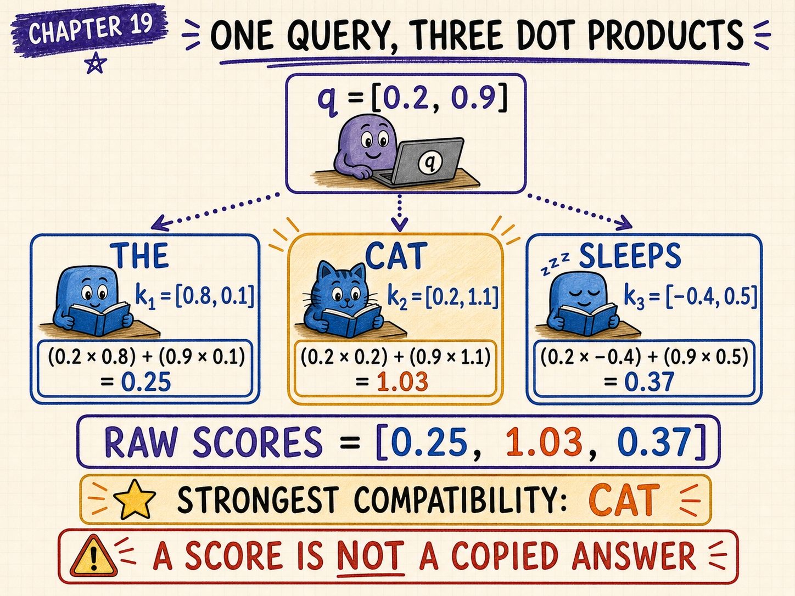

The raw dot products are:

$$
qK^T
=
\begin{bmatrix}
0.2&0.9
\end{bmatrix}
\begin{bmatrix}
0.8&0.2&-0.4\\
0.1&1.1&0.5
\end{bmatrix}
$$

For source position 0:

$$
0.2(0.8)+0.9(0.1)
=0.16+0.09
=0.25
$$

For source position 1:

$$
0.2(0.2)+0.9(1.1)
=0.04+0.99
=1.03
$$

For source position 2:

$$
0.2(-0.4)+0.9(0.5)
=-0.08+0.45
=0.37
$$

Therefore:

$$
qK^T
=
\begin{bmatrix}
0.25&1.03&0.37
\end{bmatrix}
$$

The strongest raw compatibility is with source position 1, `CAT`.

# Step 2: scale the scores

Scaled dot-product attention divides by:

$$
\sqrt{d_k}=\sqrt{2}
$$

The scaled scores are:

$$
s
=
\frac{1}{\sqrt{2}}
\begin{bmatrix}
0.25&1.03&0.37
\end{bmatrix}
$$

$$
s
\approx
\begin{bmatrix}
0.176777&0.728320&0.261630
\end{bmatrix}
$$

Scaling moderates the magnitude before softmax.

# Step 3: apply the source mask

Suppose all three source tokens are real, non-padding positions.

Then:

$$
M_{\mathrm{source}}
=
\begin{bmatrix}
0&0&0
\end{bmatrix}
$$

and the scores remain unchanged.

If the third source position were padding, a typical additive mask would be:

$$
M_{\mathrm{source}}
=
\begin{bmatrix}
0&0&-\infty
\end{bmatrix}
$$

After softmax, the padding position would receive weight zero.

# Step 4: turn scores into attention weights

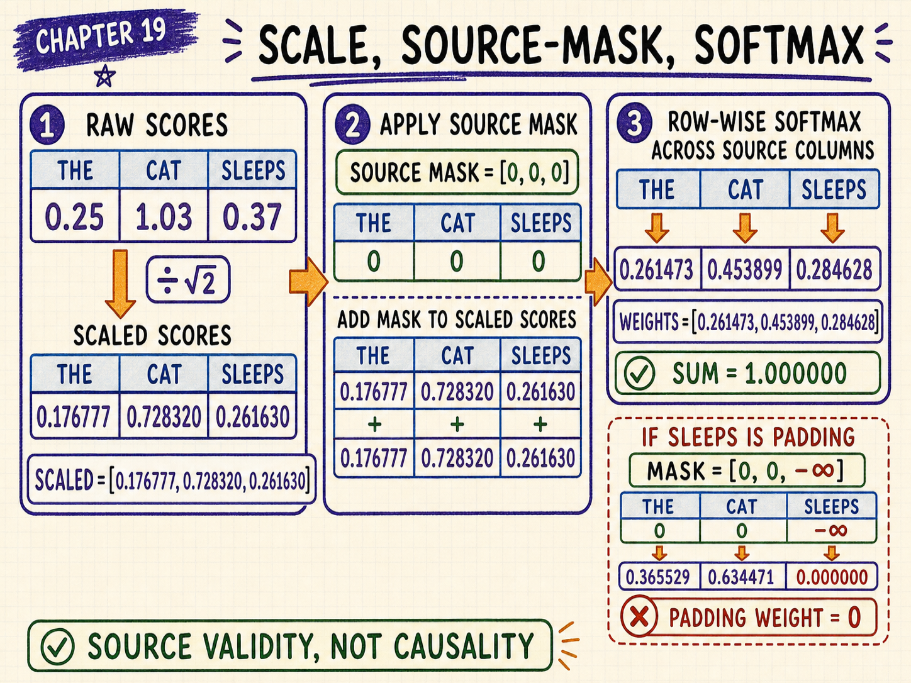

Apply softmax across the source positions:

$$
a_j
=
\frac{e^{s_j}}
{\sum_{r=1}^{3}e^{s_r}}
$$

The resulting weights are approximately:

$$
a
\approx
\begin{bmatrix}
0.261473&0.453899&0.284628
\end{bmatrix}
$$

The weights sum to one:

$$
0.261473+0.453899+0.284628
=1.000000
$$

The decoder position pays the most attention to `CAT`, while still retrieving information from the other source positions.

# Step 5: retrieve a weighted mixture of encoder Values

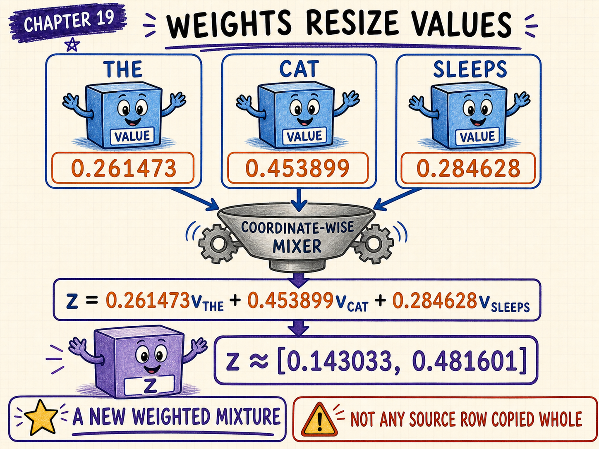

The cross-attention output is:

$$
z=aV
$$

Substitute the values:

$$
z
=
0.261473
\begin{bmatrix}
0.7&-0.2
\end{bmatrix}
+
0.453899
\begin{bmatrix}
0.1&0.8
\end{bmatrix}
+
0.284628
\begin{bmatrix}
-0.3&0.6
\end{bmatrix}
$$

First coordinate:

$$
0.261473(0.7)
+0.453899(0.1)
+0.284628(-0.3)
\approx0.143033
$$

Second coordinate:

$$
0.261473(-0.2)
+0.453899(0.8)
+0.284628(0.6)
\approx0.481601
$$

Therefore:

$$
z
\approx
\begin{bmatrix}
0.143033&0.481601
\end{bmatrix}
$$

This vector is not a copy of one source token.

It is a learned weighted mixture of encoder-side information.

# What the output means

The decoder’s Query decided how to weight source Keys.

The selected weights mixed source Values.

The result carries source-conditioned information into the decoder stream.

Conceptually:

```text
Query: What source information do I need now?
Keys:  When is each source position relevant?
Values: What information should each source position contribute?
```

# Extending from one target position to many

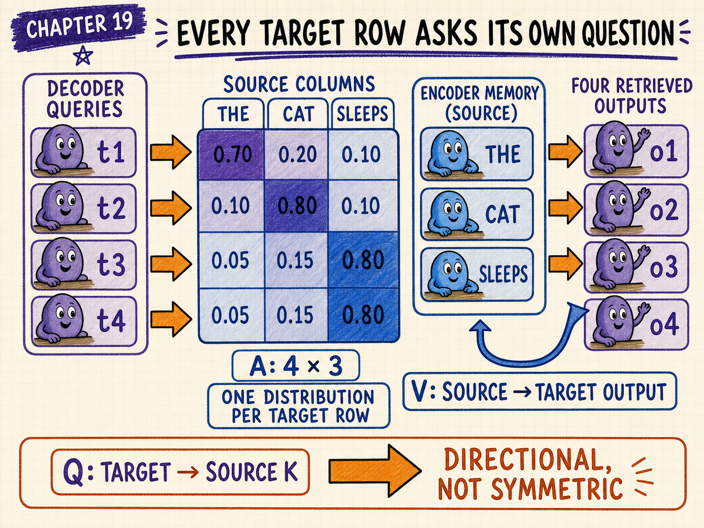

Suppose the decoder currently contains four target positions.

Then:

$$
Q
\in
\mathbb{R}^{4\mathbin{×}2}
$$

and the source still has three positions:

$$
K,V
\in
\mathbb{R}^{3\mathbin{×}2}
$$

The score matrix becomes:

$$
QK^T
\in
\mathbb{R}^{4\mathbin{×}3}
$$

Each target row produces a separate distribution over the same three source columns.

The first target token may focus on one source word. A later target token may focus on another.

# Cross-attention is directional

The decoder attends to the encoder memory.

That does not mean the encoder hidden states are recomputed after every target token.

A standard inference flow is:

```text
1. Encode the source once.
2. Project or cache encoder-side Keys and Values.
3. Generate target token 1 using cross-attention.
4. Generate target token 2 using the same source memory.
5. Continue until stopping.
```

This is one reason encoder–decoder inference can reuse source-side computation.

# Source Keys and Values can be cached

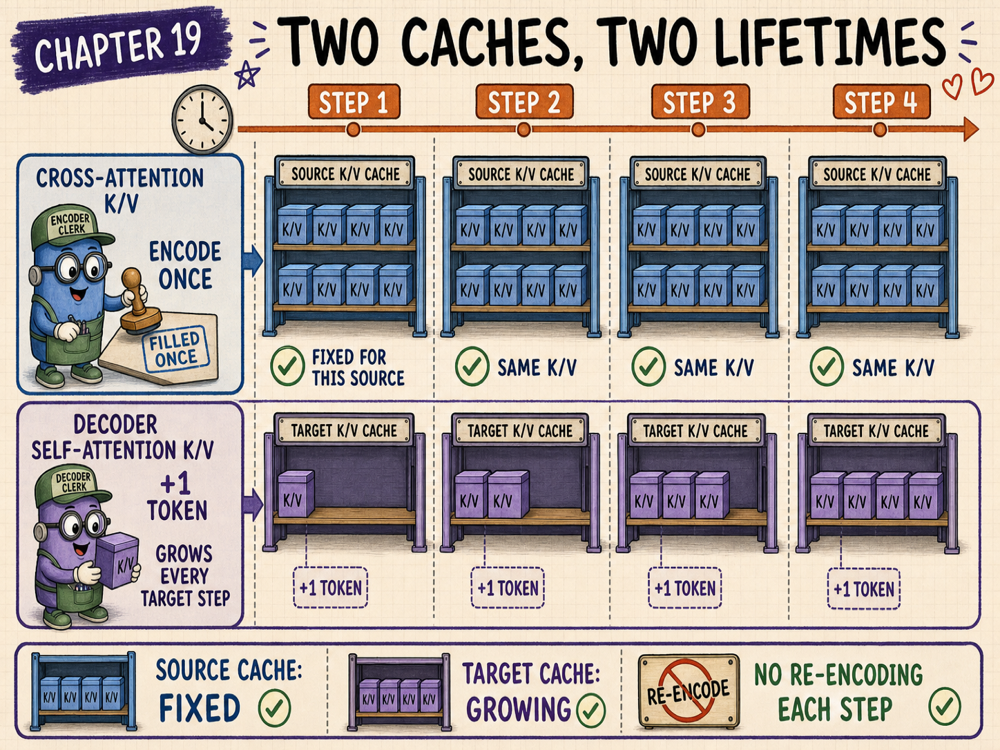

For each cross-attention layer, the encoder memory is fixed during generation of one target sequence.

The projected source Keys and Values can therefore be computed once and reused.

Decoder self-attention has a different cache: it grows as target tokens are generated.

```text
cross-attention cache
    fixed source length

self-attention KV cache
    grows with generated target length
```

Keeping these caches conceptually separate prevents many implementation mistakes.

# Multi-head cross-attention

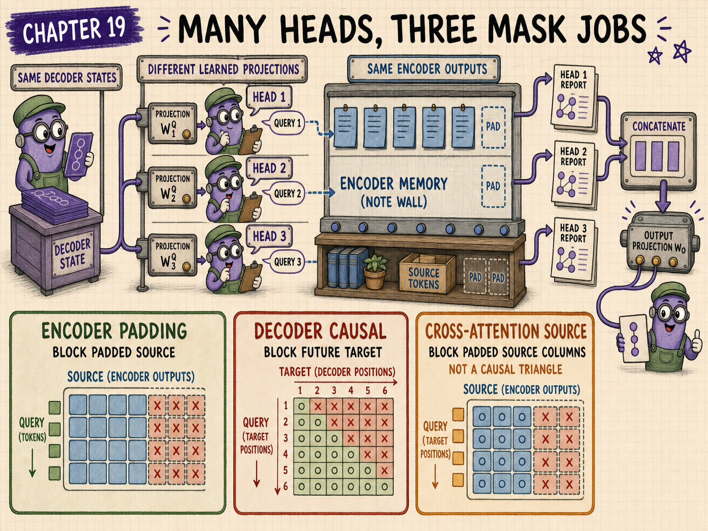

As with self-attention, a real block usually uses multiple heads.

For head $h$:

$$
Q_h=H_{\mathrm{dec}}W_h^Q
$$

$$
K_h=H_{\mathrm{enc}}W_h^K
$$

$$
V_h=H_{\mathrm{enc}}W_h^V
$$

Then:

$$
Z_h
=
\operatorname{softmax}
\left(
\frac{Q_hK_h^T}{\sqrt{d_k}}+M
\right)V_h
$$

The head outputs are concatenated and mixed through an output projection.

Different heads can learn different source–target relationships such as lexical alignment, syntax, position, speaker identity, acoustic events, or formatting cues.

# Where cross-attention appears

Cross-attention is common when one representation conditions another sequence.

Examples include:

- machine translation;
- summarisation;
- text-to-text transformation;
- speech recognition with an audio encoder and text decoder;
- image-conditioned text generation;
- retrieval or memory modules inserted into a decoder;
- multimodal systems that let language tokens inspect visual features.

Not every multimodal system uses the same connector. Some use projectors or shared token spaces instead of a classic encoder–decoder cross-attention block.

# Cross-attention versus concatenating everything into one prompt

A decoder-only model can concatenate source and target into one causal sequence:

```text
[source tokens][separator][target tokens]
```

Target positions can attend backward to source positions.

That can emulate conditional generation without a separate encoder.

The trade-off is architectural:

- the source is processed through the same causal stack;
- source and target share one sequence budget;
- there is no separately reusable bidirectional source memory;
- source representations may be computed differently from a dedicated encoder.

Neither approach is universally better. The design depends on data, scale, latency, modality, and task structure.

# Masks in encoder–decoder systems

Three masks may appear in one training example.

## Encoder padding mask

Blocks padded source positions from encoder self-attention.

## Decoder causal mask

Prevents target positions from seeing later target labels.

## Cross-attention source mask

Prevents decoder Queries from attending to padded or forbidden encoder positions.

The cross-attention source mask usually follows source validity, not target causality.

# Common cross-attention mistakes

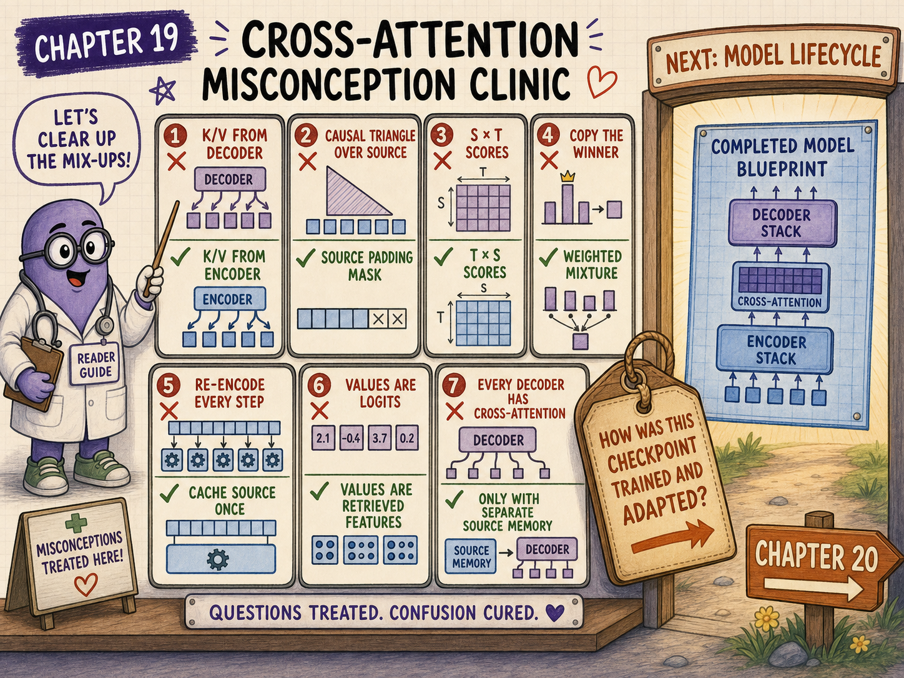

## Mistake 1: projecting all Q, K, and V from the decoder

That describes decoder self-attention, not encoder–decoder cross-attention.

## Mistake 2: applying the decoder causal triangle across source positions

The source has already been encoded. Cross-attention usually allows each target position to inspect every valid source position.

## Mistake 3: mixing up score and output shapes

The score matrix has shape $T\mathbin{×}S$. The retrieved output has shape $T\mathbin{×}d_v$.

## Mistake 4: saying attention copies the highest-scoring source token

Softmax normally creates a distribution, and the output is a weighted mixture of Values.

## Mistake 5: re-encoding the source for every generated target token

The encoder outputs and source-side cross-attention projections can normally be reused.

## Mistake 6: confusing source Values with vocabulary logits

Values are internal vectors. Vocabulary logits are produced later by the output head.

## Mistake 7: assuming every decoder contains cross-attention

Decoder-only language models generally use causal self-attention without a separate encoder memory.

# Checkpoint

<div class="exercise">

## 1. Which side produces cross-attention Queries?

The decoder side.

## 2. Which side produces cross-attention Keys and Values?

The encoder side.

## 3. If target length is 5 and source length is 8, what is the score-matrix shape?

$$
5\mathbin{×}8
$$

## 4. What is the raw score between $q=[0.2,0.9]$ and the second Key $[0.2,1.1]$?

$$
0.2(0.2)+0.9(1.1)=1.03
$$

## 5. Why divide by $\sqrt{d_k}$?

To control score scale before softmax as head width grows.

## 6. Which source position received the largest weight in the numerical example?

Position 1, `CAT`, with approximately $0.453899$.

## 7. What was the retrieved vector?

$$
\begin{bmatrix}
0.143033&0.481601
\end{bmatrix}
$$

## 8. Does the cross-attention output equal one encoder Value row?

Not generally. It is a weighted mixture.

## 9. Which cache grows during target generation?

The decoder self-attention KV cache.

## 10. Which cache remains fixed for one encoded source?

The source-side cross-attention Keys and Values.

</div>

# Chapter takeaway

Cross-attention creates a controlled information bridge between two sequences.

The decoder asks with Queries. The encoder memory advertises relevance through Keys and supplies content through Values.

In our story:

> **The Translator writes from the target prefix, pauses, points to the Encoder’s wall of notes, and asks: “Which parts of the source matter for the word I am writing now?”**

# Coming next: where did the model come from?

We now know how major Transformer families move information.

The next chapter zooms out from architecture to the model lifecycle: pretraining, base checkpoints, foundation models, continued pretraining, fine-tuning, instruction tuning, adapters, preferences, prompting, and retrieval.

# Further reading

- [Attention Is All You Need](https://arxiv.org/abs/1706.03762)
- [Exploring the Limits of Transfer Learning with a Unified Text-to-Text Transformer](https://arxiv.org/abs/1910.10683)
- [Robust Speech Recognition via Large-Scale Weak Supervision](https://arxiv.org/abs/2212.04356)
